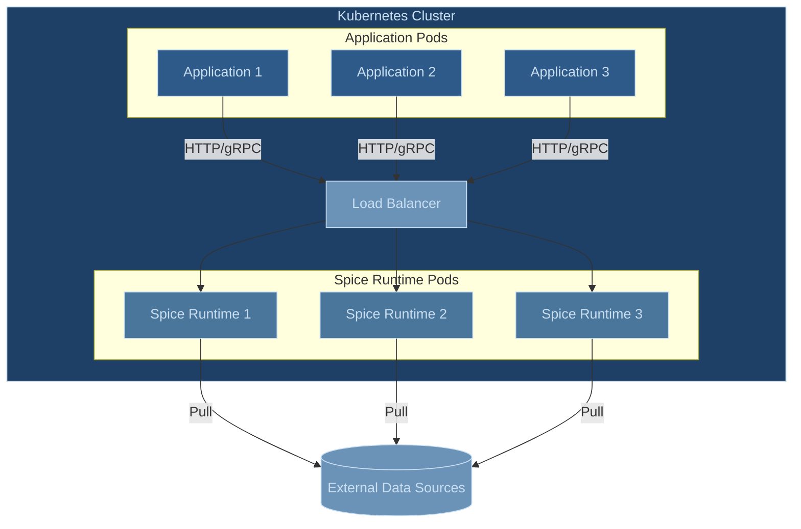

# Microservice Deployment Architecture

The microservice deployment pattern runs the Spice.ai Runtime as an independent service, optionally with multiple replicas behind a load balancer. This architecture provides scalability and flexibility in serving multiple applications while maintaining high availability.

## Architecture Overview

In a microservice deployment, one or more Spice Runtime instances operate independently from the applications they serve. Applications communicate with the runtime through HTTP/gRPC over the network, typically via a load balancer that distributes requests across available runtime instances.



## Key Benefits and Considerations

The microservice architecture offers centralized management of data acceleration and caching while enabling independent scaling of both applications and the runtime. This approach efficiently serves multiple applications and teams, reducing duplication of data and resources across the organization.

However, network communication introduces additional latency compared to sidecar deployments. The architecture requires careful consideration of service discovery, load balancing, and network security. Resource allocation must account for the combined needs of all consuming applications.

## Configuration Examples

> [!TIP]
> Start off with the simplest configuration (i.e. full refresh) and then move to more complex configurations (i.e. append mode, CDC) as the dataset size and refresh requirements increase.

### Simple Full Refresh

This example demonstrates a basic configuration for a product catalog, suitable for smaller datasets that change periodically:

```yaml
version: v1
kind: Spicepod
name: product-catalog

datasets:
  - from: https://api.company.com/v1/products
    name: products
    description: Product catalog data for active electronics category
    params:
      http_username: api-user
      http_password: ${secrets:API_KEY}
    acceleration:
      enabled: true
      engine: duckdb
      refresh_mode: full         # Replace entire dataset on each refresh
      refresh_sql: |             # Accelerate specific product subset
        SELECT * FROM products 
        WHERE category = 'electronics' 
        AND status = 'active'
      refresh_check_interval: 1h # Refresh hourly or via API
```

### Time-Based Append Mode

This example shows a configuration for customer interaction data, optimized for a dataset that only appends data or updates data with a timestamp column to indicate when the data was updated.

```yaml
version: v1
kind: Spicepod
name: customer-portal

datasets:
  - from: https://customer-events.company.com/v1/interactions
    name: customer-interactions
    description: Customer support interactions and engagement history
    time_column: interaction_timestamp # Column used to track when data is updated
    params:
      http_username: customer-service
      http_password: ${secrets:CUSTOMER_API_KEY}
      client_timeout: 30s
    acceleration:
      enabled: true
      engine: duckdb # Persist the accelerated data to a DuckDB file
      mode: file
      refresh_mode: append # Append only the data that has changed since the last refresh
      refresh_sql: | # Configure the initial load of the dataset to only load data from the last 90 days
        SELECT * FROM customer_interactions 
        WHERE interaction_timestamp >= NOW() - INTERVAL '90 days'
      primary_key: interaction_id # Primary key is required if data is updated in place as opposed to only appending new data
      on_conflict:
        interaction_id: upsert # Tell the runtime how to handle conflicts when updating data in place, i.e. update the existing row with the new data
      refresh_check_interval: 30s # Refresh the data every 30 seconds
      refresh_retry_enabled: true # Retry the refresh if it fails
      refresh_retry_max_attempts: 3 # Retry the refresh up to 3 times
      retention_check_enabled: true # Check if the data is older than the retention period
      retention_period: 90d # Retain the data for 90 days
      retention_check_interval: 24h # Run a cleanup of old data every 24 hours
```

### Kubernetes Deployment Configuration

This example demonstrates how to configure the Spice Runtime deployment in Kubernetes with proper resource management and scaling:

```yaml
apiVersion: apps/v1
kind: Deployment
metadata:
  name: spice-runtime
  namespace: spice-system
spec:
  replicas: 3  # Initial number of replicas, scale up/down as needed
  template:
    spec:
      containers:
        ...
```

By default the Spice runtime only listens on the localhost interface, meaning it is not accessible from outside the pod. The following PodSpec configuration exposes the runtime APIs on all interfaces and the default ports.

```yaml
containers:
  - name: spiceai
    image: spiceai/spiced:latest
    imagePullPolicy: Always
    workingDir: /app
    command:
      [
        "/usr/local/bin/spiced",
        "--http",
        "0.0.0.0:8090",
        "--metrics",
        "0.0.0.0:9090",
        "--flight",
        "0.0.0.0:50051",
        "--open_telemetry",
        "0.0.0.0:50052"
      ]
```

> [!WARNING]
> The above configuration exposes the runtime on all interfaces and the default ports over insecure HTTP/gRPC and without authentication. Consider securing the runtime with [TLS](https://spiceai.org/docs/api/tls) and adding [API key authentication](https://spiceai.org/docs/api/auth) for production environments.

## Operational Considerations

Consider using an autoscaler such as the [Kubernetes Horizontal Pod Autoscaler](https://kubernetes.io/docs/tasks/run-application/horizontal-pod-autoscale/) to automatically scale the number of runtime replicas based on CPU utilization, memory usage, request latency, and active concurrent connections.

High availability is achieved by running multiple replicas in Kubernetes. Node selectors and taints can be used to ensure that the runtime pods are scheduled across specific nodes to improve fault tolerance. Consistent health checks and readiness probes verify that each replica contains the correct data and is ready to serve requests. Rolling updates combined with specific resource requests and limits help maintain uninterrupted service during maintenance and outages.

Monitoring and alerting form a vital part of sustaining system stability. Spice provides several [metrics](https://spiceai.org/docs/features/observability#metrics) that can be used to monitor the runtime.

Network security relies on secure communication channels and access controls. Transport Layer Security (TLS) secures data in transit, while authentication and network policies restrict access to sensitive APIs. In some environments, a service mesh provides further security measures. Regular audits and updates address emerging vulnerabilities. For more information about network security in Kubernetes, consult the [Kubernetes Network Policies documentation](https://kubernetes.io/docs/concepts/services-networking/network-policies/).

## Use Case Evaluation

The microservice pattern is ideal for:

- Organizations with multiple teams or applications requiring data acceleration
- Scenarios requiring independent scaling of the runtime
- Cases where centralized management of data and resources is preferred
- Applications that can tolerate some network latency

Consider alternative architectures when:

- Ultra-low latency is required (consider sidecar pattern)
- Network bandwidth is constrained
- Applications have strict data isolation requirements
- The overhead of managing a distributed system outweighs the benefits

For additional deployment patterns, refer to the [Deployment Architectures Overview](https://spiceai.org/docs/deployment/architectures).
