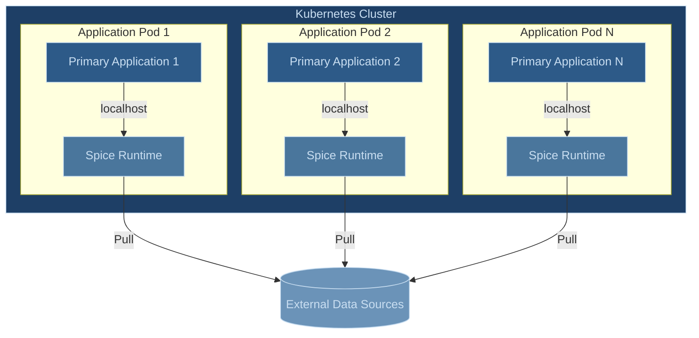

# Sidecar Deployment Architecture

The sidecar deployment pattern runs the Spice.ai Runtime as a companion container or process alongside the main application on the same host. This architecture provides low-latency access to accelerated data through localhost communication.

## Architecture Overview

In a sidecar deployment, each application pod includes both the primary application container and a Spice Runtime container. The containers communicate over localhost. The Spice Runtime container manages data acceleration and caching, pulling data from external sources based on configured refresh strategies.



## Key Benefits and Considerations

The sidecar architecture minimizes latency between the application and runtime through direct localhost communication. Co-located containers share lifecycle management, eliminating the need for additional service discovery or complex networking. Data remains close to the application that needs it, and each application instance scales independently with its own data acceleration.

However, this approach requires dedicated runtime resources for each application instance, leading to data replication across instances. Applications must handle runtime initialization, and runtime updates necessitate updating all application pods and vice versa. The sidecar pattern is best suited for low-latency applications with small to moderate scaling requirements.

## Configuration Examples

> [!TIP]
> Start off with the simplest configuration (i.e. full refresh) and then move to more complex configurations (i.e. append mode, CDC) as the dataset size and refresh requirements increase.

### Simple Full Refresh

This example demonstrates a basic configuration for a product catalog, suitable for smaller datasets that change periodically:

```yaml
version: v1
kind: Spicepod
name: product-catalog

datasets:
  - from: https://api.company.com/v1/products
    name: products
    description: Product catalog data for active electronics category
    params:
      http_username: api-user
      http_password: ${secrets:API_KEY}
    acceleration:
      enabled: true
      engine: duckdb
      refresh_mode: full         # Replace entire dataset on each refresh
      refresh_sql: |             # Accelerate specific product subset
        SELECT * FROM products 
        WHERE category = 'electronics' 
        AND status = 'active'
      refresh_check_interval: 1h # Refresh hourly or via API
```

### Time-Based Append Mode

This example shows a configuration for customer interaction data, optimized for a dataset that only appends data or updates data with a timestamp column to indicate when the data was updated.

```yaml
version: v1
kind: Spicepod
name: customer-portal

datasets:
  - from: https://customer-events.company.com/v1/interactions
    name: customer-interactions
    description: Customer support interactions and engagement history
    time_column: interaction_timestamp # Column used to track when data is updated
    params:
      http_username: customer-service
      http_password: ${secrets:CUSTOMER_API_KEY}
      client_timeout: 30s
    acceleration:
      enabled: true
      engine: duckdb # Persist the accelerated data to a DuckDB file
      mode: file
      refresh_mode: append # Append only the data that has changed since the last refresh
      refresh_sql: | # Configure the initial load of the dataset to only load data from the last 90 days
        SELECT * FROM customer_interactions 
        WHERE interaction_timestamp >= NOW() - INTERVAL '90 days'
      primary_key: interaction_id # Primary key is required if data is updated in place as opposed to only appending new data
      on_conflict:
        interaction_id: upsert # Tell the runtime how to handle conflicts when updating data in place, i.e. update the existing row with the new data
      refresh_check_interval: 30s # Refresh the data every 30 seconds
      refresh_retry_enabled: true # Retry the refresh if it fails
      refresh_retry_max_attempts: 3 # Retry the refresh up to 3 times
      retention_check_enabled: true # Check if the data is older than the retention period
      retention_period: 90d # Retain the data for 90 days
      retention_check_interval: 24h # Run a cleanup of old data every 24 hours
```

## Operational Considerations

### Dataset Size Management

Small datasets perform well with in-memory acceleration using Arrow/DuckDB. Medium-sized datasets benefit from file-mode DuckDB for persistence between restarts and improved startup times. Large datasets may require investigating an alternative architecture if performance or startup times are not acceptable.

The choice between these approaches depends on host machine performance and network speed between the runtime and data source. Starting with a simple full refresh configuration and progressing to more complex configurations (i.e. append mode) as requirements evolve is recommended.

### Refresh Strategy Selection

The full refresh strategy works effectively for small datasets with periodic updates and cases requiring strict data consistency. Append mode suits time-series data and continuous data streams with reliable timestamp columns.

### Resource Management and Monitoring

Effective resource management requires monitoring both memory and CPU usage patterns. Key metrics to track include runtime memory utilization, refresh operation duration, query response times, and cache effectiveness. Setting appropriate resource limits and requests helps prevent resource contention.

Common operational challenges include slow startup times, memory pressure, and data freshness concerns. These can be addressed through dataset optimization, appropriate resource allocation, and monitoring of refresh operations.

## Use Case Evaluation

The sidecar pattern is most effective for applications requiring minimal data access latency, with small to medium dataset sizes and limited deployment instances. Alternative architectures should be considered when dataset sizes grow too large, deployments require many instances, or complex data sharing patterns exist.

For additional deployment patterns, refer to the [Deployment Architectures Overview](https://spiceai.org/docs/deployment/architectures).
