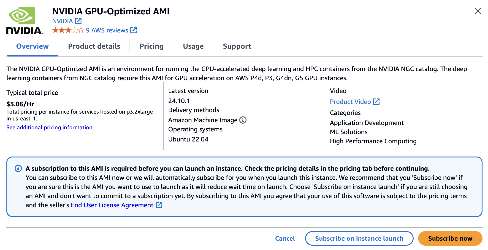
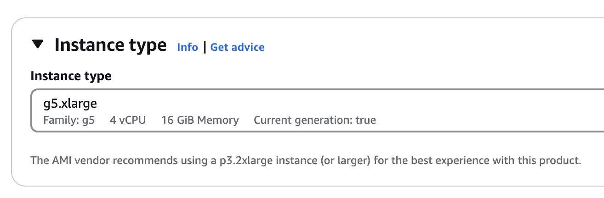
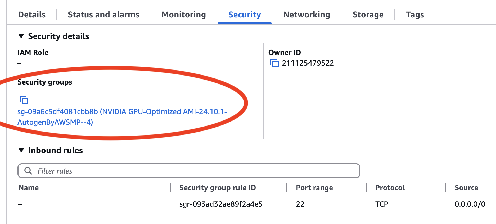
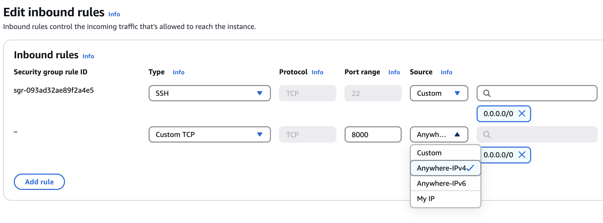

# Nvidia NIM on AWS EC2 g5.xlarge

This recipe deploys Nvidia [NIM](https://docs.nvidia.com/nim/) on an AWS EC2 g5.xlarge instance. A local Spice instance runs and connects to the NIM OpenAI compatible LLM as a model.

## Prerequisites

 1. An AWS account.
 2. Spice installed locally, see [Spice Installation](https://spiceai.org/docs/installation)

## Deploying NIM

### Create a new EC2 g5.xlarge instance

1. In the AWS Management Console, select **EC2**.
2. Click **Launch Instance**.
3. Add a name to the instance, e.g. `nvidia-nim-testing`.
4. Select the `NVIDIA GPU-Optimized AMI` for the machine image, it will be available in the AWS Marketplace AMIs.

  

5. Select the **g5.xlarge** instance type.

  

6. Select or create a new key pair.
7. Allow SSH access from your IP address.
8. Leave all other settings as default and click **Launch instance**.

### Connect to the instance

1. In the EC2 Dashboard, select the instance you just created.
2. Copy the public IP address of the instance.
3. Open a terminal and run `ssh -i <path-to-your-key-pair> ubuntu@<public-ip-address>`. Wait for the instance to be ready and drivers installed.

  ```bash
  Welcome to the NVIDIA GPU Cloud image.  This image provides an optimized
  environment for running the deep learning and HPC containers from the
  NVIDIA GPU Cloud Container Registry.  Many NGC containers are freely
  available.  However, some NGC containers require that you log in with
  a valid NGC API key in order to access them.  This is indicated by a
  "pull access denied for xyz ..." or "Get xyz: unauthorized: ..." error
  message from the daemon.

  Documentation on using this image and accessing the NVIDIA GPU Cloud
  Container Registry can be found at
    http://docs.nvidia.com/ngc/index.html

  Installing drivers ...
  Install complete
  ubuntu is being added to docker group,
  prefix sudo to all your docker commands,
  or re-login to use docker without sudo
  ```

After the drivers are installed, logout and login again to the instance to allow running Docker commands as the `ubuntu` user.

### Get a NGC API key and login to the Docker registry

1. Get a NGC API key from Nvidia's NGC [website](https://org.ngc.nvidia.com/setup/personal-keys).
2. Login to Nvidia's Docker registry on the instance

    ```shell
    docker login nvcr.io --username '$oauthtoken' # Enter your NGC API key when prompted for a password
    ```

### Run a Phi-3 NIM model

Run these commands on the instance:

```bash
export NGC_API_KEY="<your-api-key>"
export CONTAINER_NAME=Phi-3-Mini-4K-Instruct
export IMG_NAME="nvcr.io/nim/microsoft/phi-3-mini-4k-instruct:1.2.3"
export LOCAL_NIM_CACHE=~/.cache/nim
mkdir -p "$LOCAL_NIM_CACHE"

# Start the NIM model
docker run -it --rm --name=$CONTAINER_NAME \
  --runtime=nvidia \
  --gpus all \
  --shm-size=16GB \
  -e NGC_API_KEY=$NGC_API_KEY \
  -v "$LOCAL_NIM_CACHE:/opt/nim/.cache" \
  -u $(id -u) \
  -p 8000:8000 \
  $IMG_NAME
```

While waiting for the model to start, configure the AWS security group to allow inbound traffic on port 8000.

### Configure the security group

1. On the instance details page, click the **Security** tab. Click the **Security groups** link.

  

2. Click **Edit inbound rules**.
3. Add a new rule to allow inbound traffic on port 8000 from your IP address or all IP addresses.

  

4. Click **Save rules**.

### Run Spice and connect to the NIM model

Create a `spicepod.yaml` file with the following content:

```yaml
version: v1
kind: Spicepod
name: nvidia_nim

models:
  - from: openai:microsoft/phi-3-mini-4k-instruct
    name: phi
    params:
      endpoint: http://<ec2-public-ip>:8000/v1
      system_prompt: "Talk to the user like a pirate"
```

Once the Phi model has started (you see the log 'Uvicorn running on <http://0.0.0.0:8000>'), run Spice:

```bash
spice run
2025/01/17 12:09:52 INFO Checking for latest Spice runtime release...
2025/01/17 12:09:53 INFO Spice.ai runtime starting...
2025-01-17T03:09:54.439824Z  INFO runtime::init::dataset: No datasets were configured. If this is unexpected, check the Spicepod configuration.
2025-01-17T03:09:54.440000Z  INFO runtime::init::model: Loading model [phi] from openai:microsoft/phi-3-mini-4k-instruct...
2025-01-17T03:09:54.440281Z  INFO runtime::metrics_server: Spice Runtime Metrics listening on 127.0.0.1:9090
2025-01-17T03:09:54.440275Z  INFO runtime::flight: Spice Runtime Flight listening on 127.0.0.1:50051
2025-01-17T03:09:54.440520Z  INFO runtime::http: Spice Runtime HTTP listening on 127.0.0.1:8090
2025-01-17T03:09:54.441354Z  INFO runtime::opentelemetry: Spice Runtime OpenTelemetry listening on 127.0.0.1:50052
2025-01-17T03:09:54.639962Z  INFO runtime::init::results_cache: Initialized results cache; max size: 128.00 MiB, item ttl: 1s
2025-01-17T03:09:56.431766Z  INFO runtime::init::model: Model [phi] deployed, ready for inferencing
```

Chat with the model using `spice chat`:

```bash
$ spice chat
Using model: phi
chat> What can you do?
Ahoy there, matey! I be skilled at a vast array of tasks, spanning different fields with the finesse of a captain at the helm! Whether ye be needin' help with the highest branches of technology or the simplest of tasks, ask and ye shall e'er receive. Now, to assist ye better, I need a focused question or a particular area ye wish to conquer together. Ready to set sail on this journey with me, y'all?

Time: 1.82s (first token 0.21s). Tokens: 122. Prompt: 21. Completion: 101 (62.41/s).
```
