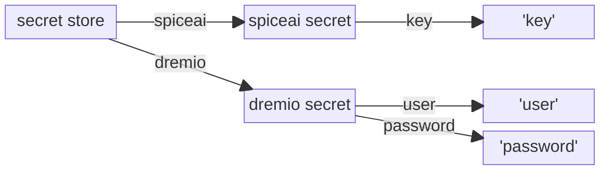

## Secret

A Secret is an object used to store sensitive data, like a passwords, a tokens, or keys.

## Secret Stores

The secret store is a location where the `secret` objects are stored.

Spice.ai supports four types of secret stores: `file`, `env`, `kubernetes` and `keyring`. The type of secret store is specified in the `store` field of the `secrets` section in the Spicepod manifest.

### File Secret Store


The Spice.ai CLI provides two commands, `spice login` and `spice login dremio`, which are designed to simplify the process of storing credentials. When executed, these commands will automatically persist the corresponding credentials in the file secret store.

### Environment Secret Store

The `env` store type allows Spice.ai to read secrets from environment variables. The environment variables should be formatted like `SPICED_SECRET_<secret-name>_<secret-value-key>`. 

All variables with the same prefix `SPICED_SECRET_<secret-name>` are combined into a single secret. This allows you to group related secret values under a single secret name.

**Example**

```yaml
secrets:
  store: env
```

Setting `spiceai` secret with spice.ai API key in `key` secret value:

```bash
SPICED_SECRET_SPICEAI_KEY="343533|**************" \
  spice run
```

### Kubernetes Secret Store

The `kubernetes` store type allows Spice.ai to read Kubernetes secrets.

```yaml
secrets:
  store: kubernetes
```

Note: This method requires the Kubernetes service account, which is running the Spice.ai pod, to have extended roles for secrets API access. Make sure to configure this service account with the necessary permissions to read secrets from the Kubernetes API.

Example of Kubernetes role configuration for a custom service account:

```yaml
kind: Role
apiVersion: rbac.authorization.k8s.io/v1
metadata:
  name: spiced-account-role
rules:
  - apiGroups: [""]
    resources: ["secrets"]
    verbs: ["get"]
```

### Keyring Secret Store

> ⚠️ Keyring store can be enabled by building [spiced](https://github.com/spiceai/spiceai/tree/trunk/bin/spiced) with `keyring-secret-store` cargo feature.

The `keyring` store allows Spice.ai to access secrets from the secure store of the host operating system:

- On Linux, it uses the secret-service and kernel keyutils.
- On macOS, it uses the keychain.
- On Windows, it uses the credential manager.

The keyring store will read entries name to be formatted as `spice_secret_<secret-name>`, and entry account or user should be set to `spiced`.

Note: secret values required to be stored as JSON strings for compatibility with Spice.ai secret objects, as the keyring store supports only string values.

**Example**

For setting `spiceai` api key secret using macOS keychain, create new keychain entry, with following JSON string value

```
"{ key: "<your spice.ai app api key>" }"
```


Then set `store` field of the `secrets` section in the Spicepod manifest:

```yaml
secrets:
  store: keyring
```


