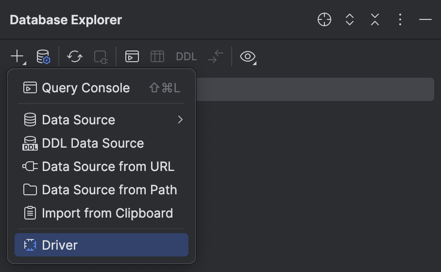
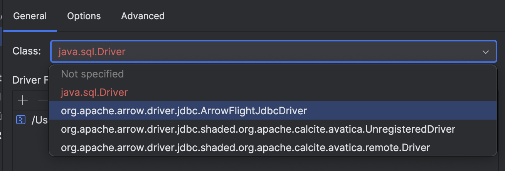
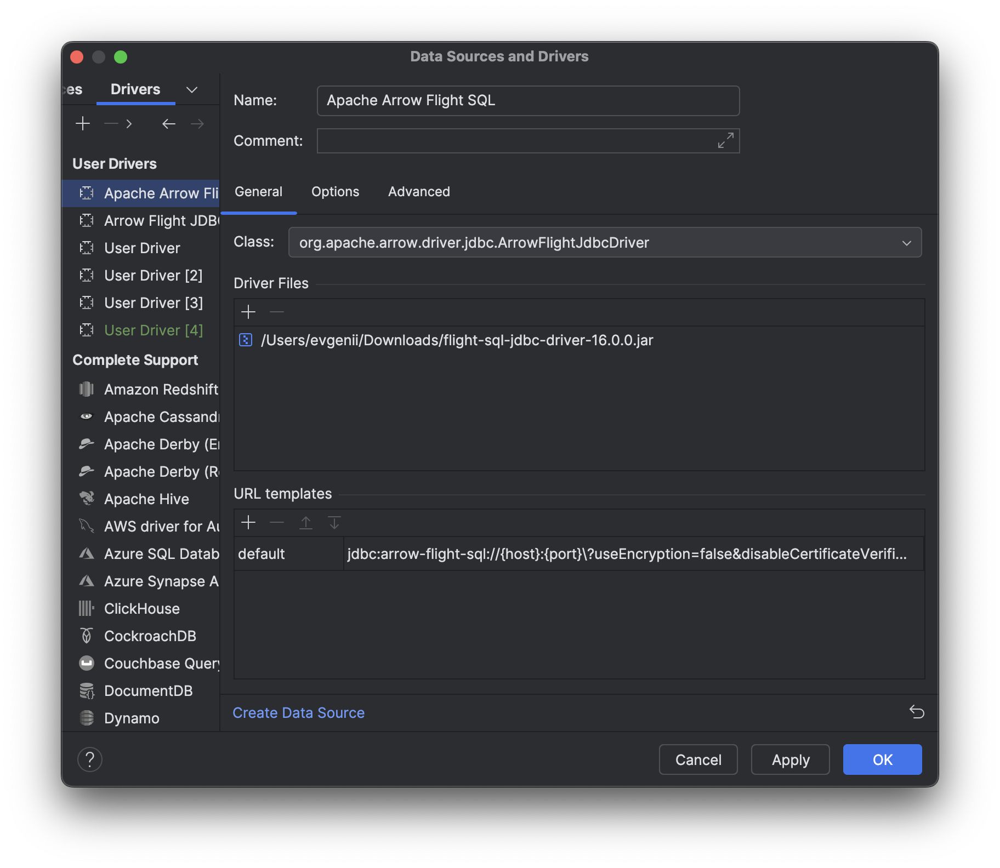
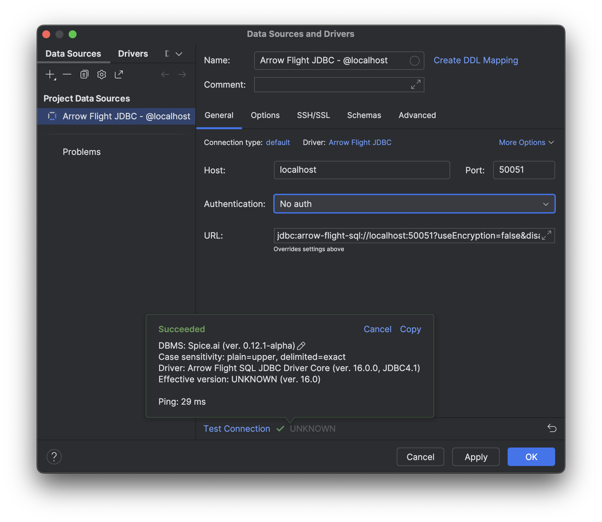
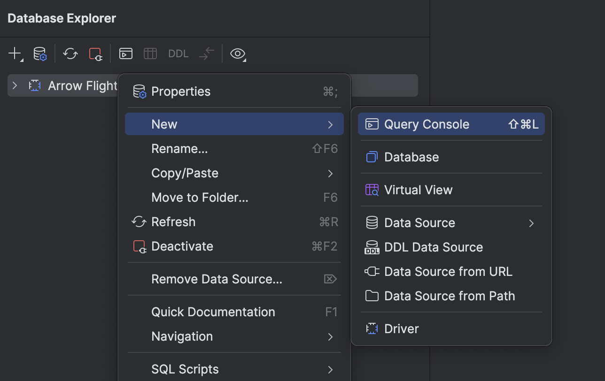
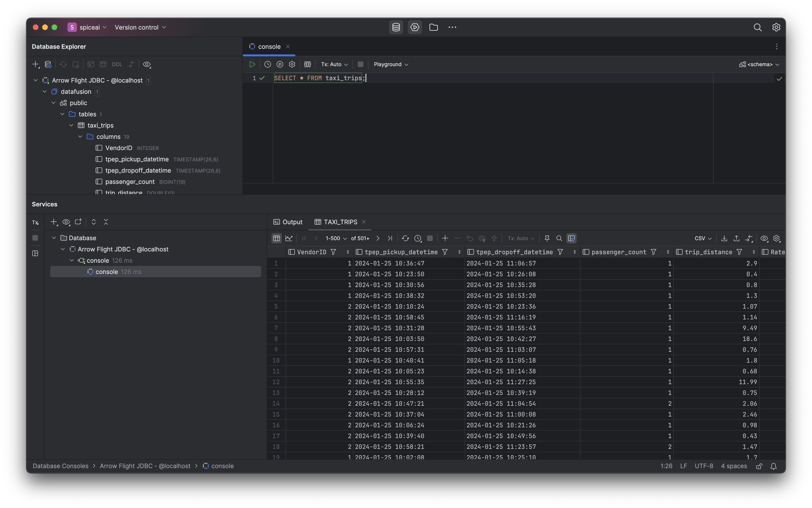

1. Start the Spice runtime with a dataset loaded. Follow the [quickstart guide](/getting-started) to get started.

2. Download [JetBrains DataGrip](https://www.jetbrains.com/datagrip).

3. Download the [Apache Arrow Flight SQL JDBC driver](https://search.maven.org/search?q=a:flight-sql-jdbc-driver) - Select "Versions", tab click "Browse" on most recent version and then download `flight-sql-jdbc-driver-<version>.jar`.

4. Launch DataGrip

5. In Database Explorer menu, select "+" and choose "Driver"
    

6. Add the JSBC jar file:
    1. Click the "+" button in "Driver Files" selection
    1. Click the "Custom JARs" button
    1. Choose the `flight-sql-jdbc-driver-<version>.jar` jar file (the file downloaded in step 3 above) - and click "Open"
    1. Click the "Class:" selector
    1. Select `org.apache.arrow.driver.jdbc.ArrowFlightJdbcDriver`
    

8. Enter the driver settings: 
    1. In the "Name" field - enter: ```Apache Arrow Flight SQL```
    1. Add "URL Template" Default: `jdbc:arrow-flight-sql://{host}:{port}\?useEncryption=false&disableCertificateVerification=true`
    1. Click "Ok"
    

9. Create a new Database Connection:
    1. In Database Explorer menu, select "+", choose "Data Source" > "Arrow Flight JDBC"
    2. Set the host to `localhost` and the port to `50051`
    3. In "Authentication" select "No auth"
    4. Click "Test Connection" to verify



10. Run a query:
    1. Right-click on the connection in Database Explorer and choose "New" > "Query Console"
    
    1. In the Console window - add a query - something like: ```SELECT * FROM taxi_trips;``` and click the triangle button to execute the SQL statement
    1. See the query results:
    

DataGrip is now configured to query the Spice runtime using SQL! 🎉
    