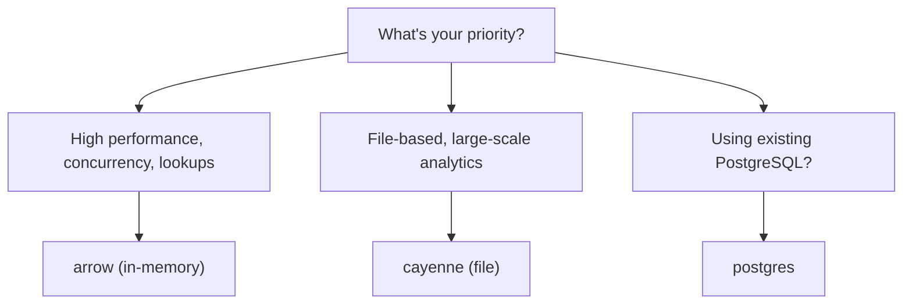

Data sourced by Data Connectors can be locally materialized and accelerated using a Data Accelerator.

A Data Accelerator queries/fetches data from a connected data source and stores/updates it locally in an embedded acceleration engine, such as Spice Cayenne, DuckDB, or SQLite. To set data refresh behavior, such as refreshing data on an interval, see [Data Refresh](../../features/data-acceleration/data-refresh).

Dataset acceleration is enabled by setting the acceleration configuration:

```yaml
datasets:
  - name: accelerated_dataset
    acceleration:
      enabled: true
```

For the complete reference specification, see [datasets](../../reference/spicepod/datasets).

By default, datasets are locally materialized using in-memory Arrow records.

## Supported Data Accelerators

| Name       | Description                     | Status            | Engine Modes     |
| ---------- | ------------------------------- | ----------------- | ---------------- |
| `arrow`    | In-Memory Arrow Records         | Stable            | `memory`         |
| `cayenne`  | [Spice Cayenne][cayenne]        | Beta              | `file`           |
| `duckdb`   | Embedded [DuckDB][duckdb]       | Stable            | `memory`, `file` |
| `postgres` | Attached [PostgreSQL][postgres] | Release Candidate | N/A              |
| `sqlite`   | Embedded [SQLite][sqlite]       | Release Candidate | `memory`, `file` |
| `turso`    | Embedded [Turso][turso]         | Beta              | `memory`, `file` |

[cayenne]: ./cayenne.md
[duckdb]: ./duckdb.md
[postgres]: data-accelerators/postgres
[sqlite]: ./sqlite.md
[turso]: ./turso.md

## Choosing an Accelerator

Select the appropriate accelerator based on dataset size, query patterns, and resource constraints:



| Use Case                                        | Recommended Accelerator | Rationale                                               |
| ----------------------------------------------- | ----------------------- | ------------------------------------------------------- |
| High performance, concurrency, lookups          | `arrow`                 | In-memory storage provides lowest latency               |
| File-based, scalable analytics (100 GB - 1+ TB) | `cayenne`               | Vortex columnar format scales beyond single-file limits |
| Point lookups on large datasets                 | `cayenne`               | Vortex provides 100x faster random access vs Parquet    |
| External database integration                   | `postgres`              | Leverage existing PostgreSQL infrastructure             |
| Complex SQL features (window functions, CTEs)   | `duckdb`                | Mature SQL support with memory management               |
| Simple queries, low resource usage              | `sqlite`                | Lightweight, minimal overhead                           |

### Arrow vs Spice Cayenne

[Arrow](data-accelerators/arrow) and [Spice Cayenne](data-accelerators/cayenne) are the primary accelerators, optimized for different workloads:

**Choose Arrow when:**

- High concurrency and low-latency lookups are the priority
- Datasets fit in memory
- Maximum query performance is required

**Choose Spice Cayenne when:**

- Datasets exceed available memory or reach 100 GB - 1+ TB
- File-based persistence is required
- Multi-file data ingestion is required (e.g., partitioned S3 data)
- Workloads benefit from Vortex's [10-20x faster scans](https://bench.vortex.dev)
- Point lookups and random access patterns are common ([100x faster than Parquet](https://bench.vortex.dev))

## Data Types

Data Accelerators may not support all possible Apache Arrow data types. For complete compatibility, see [specifications](../../reference/datatypes/accelerators).

:::warning[Memory Considerations]

When accelerating a dataset using `mode: memory` (the default), some or all of the dataset is loaded into memory. Ensure sufficient memory is available, including overhead for queries and the runtime, especially with concurrent queries.

In-memory limitations can be mitigated by storing acceleration data on disk, which is supported by [`duckdb`](data-accelerators/duckdb), [`sqlite`](data-accelerators/sqlite), and [`turso`](data-accelerators/turso) accelerators by specifying `mode: file`.

:::

## Data Accelerator Docs

import DocCardList from '@theme/DocCardList';

<DocCardList />

## Related Documentation

- [Performance Tuning](../../reference/performance-tuning) - Comprehensive optimization guide
- [Managing Memory Usage](../../reference/memory) - Memory configuration reference
- [Data Refresh](../../features/data-acceleration/data-refresh) - Refresh mode configuration
- [Indexes](../../features/data-acceleration/indexes) - Index configuration for DuckDB, SQLite, and Turso
