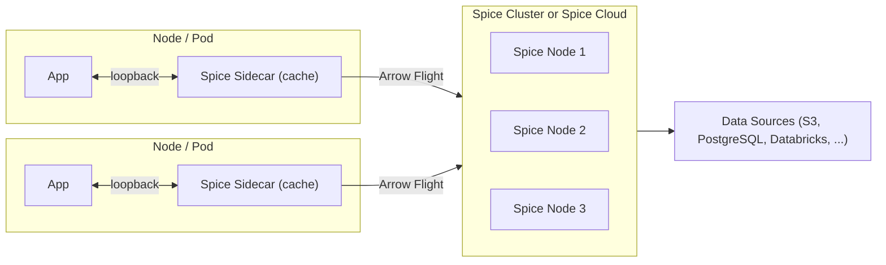

A Kubernetes-native hybrid approach designed for large-scale deployments where applications communicate with colocated Spice sidecars that primarily serve as a caching layer, while a centralized Spice cluster (or the [Spice Cloud Platform](./hosted)) handles data ingestion, acceleration, and distributed query processing. The sidecars connect to the cluster as their upstream data source, combining ultra-low-latency reads with centralized data management.

**Benefits**

- **Kubernetes-native** — designed to run on Kubernetes, leveraging pod-level sidecars with cluster-level orchestration.
- Ultra-low-latency reads via sidecar caching on loopback, with centralized data management in the cluster.
- Sidecars remain lightweight — only caching, no ingestion or acceleration overhead.
- Cluster (or Spice Cloud) handles complex operations: data ingestion, acceleration, distributed query, and refresh from sources.
- Works with both self-managed Spice clusters and the managed [Spice Cloud Platform](./hosted) as the centralized backend.
- Horizontal scalability — add sidecars without increasing load on data sources.
- Resilience — sidecars serve cached data even if the cluster is temporarily unavailable.

**Considerations**

- More complex deployment structure requiring both sidecar and cluster infrastructure.
- Cache coherency — sidecars must be configured with appropriate refresh intervals or TTLs to balance freshness with performance.
- Requires a Spice cluster deployment or Spice Cloud Platform subscription (Spice.ai Enterprise for advanced self-managed clustering features).
- Network connectivity between sidecars and the cluster must be reliable for cache refreshes.

**Use This Approach When**

- Applications require ultra-low-latency reads but data ingestion and acceleration should be centralized.
- Multiple application instances need fast access to the same datasets without each independently querying data sources.
- Reducing load on upstream data sources is a priority — the cluster ingests once, sidecars cache locally.
- The system benefits from separating the caching tier (sidecars) from the data processing tier (cluster).

**Not Ideal When**

- The application is simple with a single instance — the overhead of both sidecar and cluster infrastructure isn't justified. Consider [Sidecar](./sidecar) or [Microservice](./microservice).
- All queries are batch or analytical with relaxed latency requirements — a [Microservice](./microservice) deployment is simpler and sufficient.
- Network connectivity between sidecars and the cluster is unreliable — cache refreshes will fail, leading to stale data. Consider standalone [Sidecar](./sidecar) deployments with direct source access.

**Example Use Case**
A multi-tenant SaaS platform where each tenant's application pod includes a Spice sidecar caching frequently queried datasets. The sidecars pull from a shared Spice cluster that handles ingestion from PostgreSQL, S3, and Databricks, runs acceleration and refresh schedules, and serves distributed queries. Tenants get sub-millisecond reads from their local sidecar while the cluster manages data freshness and heavy query workloads centrally.
