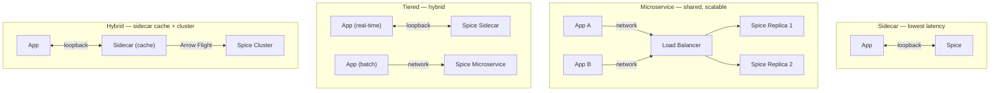

Spice supports multiple deployment architectures:

- [Sidecar Deployment](architectures/sidecar) - Deploy alongside applications
- [Microservice Deployment (Single or Multiple Replicas)](architectures/microservice) - Standalone service deployment
- [Tiered Deployment](architectures/tiered) - Edge, application, and cloud tiers
- [Cloud-Hosted in the Spice Cloud Platform](architectures/hosted) - Managed cloud deployment
- [Sharded Deployment](architectures/sharded) - Horizontal data partitioning
- [Cluster Deployment (Spice.ai Enterprise)](architectures/cluster) - Kubernetes-native distributed cluster architecture
