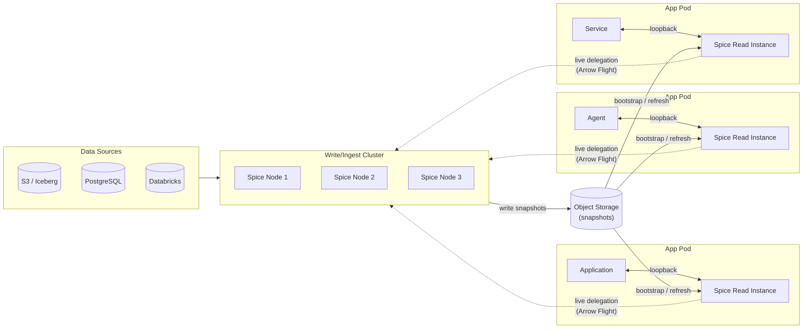

Production data and AI applications typically have two very different workloads on the same data:

- **Writes / ingest** — pulling from source systems, normalizing, accelerating, indexing, and refreshing. CPU-, network-, and memory-heavy. Bursty. Doesn't need to be co-located with the application.
- **Reads** — answering user-facing requests, feeding context to AI agents, serving dashboards. Latency-sensitive. Often horizontally scaled with the application itself.

Running both on the same Spice instance forces a single hardware shape, refresh schedule, and failure domain on workloads that have nothing in common. Read/write separation splits them into two tiers: a centralized **write/ingest cluster** that owns refresh and acceleration, and one or more lightweight **read instances** (typically [sidecars](architectures/sidecar) next to the application) that serve queries from a local materialized copy.

The two tiers communicate through two channels:

1. **Snapshots** in object storage — the cluster periodically writes a compact acceleration file (DuckDB or SQLite) to S3, GCS, or ADLS. Read instances bootstrap from the latest snapshot on startup and (optionally) refresh from snapshots on a schedule. No live network dependency on the cluster.
2. **Live query delegation** — when a read instance needs data outside its materialized working set (a historical query, a cross-dataset join, a broad search), it transparently delegates to the cluster over Arrow Flight. See [Cluster-Sidecar Architecture](architectures/cluster-sidecar).

Most production deployments use both: snapshots for the steady-state working set, and live delegation for the long tail.



## When to use read/write separation

Use this pattern when:

- Application instances need **sub-millisecond reads** but data refresh, ingestion, or acceleration would saturate them.
- The same datasets are read by **many replicas**, each currently re-ingesting from source systems.
- Read instances need to **start fast** — autoscaling, scale-to-many agent containers, or ephemeral Cloud Run / Knative workloads where cold-starting from source is too slow.
- Upstream data sources have **rate or cost limits** that prevent every replica from connecting directly.
- Read instances run **outside the cluster's network** — at the edge, in another VPC, on a developer laptop — and cannot maintain a permanent dependency on the source system.

It is overkill when one Spice instance is sufficient (start with [Sidecar](architectures/sidecar)) or when the workload is purely batch/analytical with relaxed latency (use [Microservice](architectures/microservice)).

## How it works

### The cluster (write tier)

The cluster owns every refresh, acceleration, and search index for the datasets in scope. It runs as a standalone Spice deployment — typically a Kubernetes [`Deployment`](deployment/kubernetes/helm) or [`StatefulSet`](https://docs.spice.ai/docs/enterprise/kubernetes-operator/spicepodset), or a managed [Spice Cloud](deployment/cloud) app — and holds the only credentials to the source systems.

Cluster Spicepod responsibilities:

- Connect to every source: object stores, OLTP databases, lakehouses, search indices, message queues.
- Run all refresh schedules, CDC, and stream ingest.
- Accelerate to file-mode engines (DuckDB or SQLite) so the materialization can be exported as a snapshot.
- Write [snapshots](features/data-acceleration/snapshots) to a shared object store after each refresh.

```yaml
# cluster spicepod.yaml
snapshots:
  enabled: true
  location: s3://spiceai-snapshots/prod/
  params:
    s3_auth: iam_role

datasets:
  - from: s3://my-lake/orders/
    name: orders
    params:
      file_format: parquet
    acceleration:
      enabled: true
      engine: duckdb
      mode: file
      refresh_check_interval: 5m
      snapshots: enabled # write a new snapshot after every refresh
      snapshots_trigger: refresh_complete
      snapshots_compaction: enabled
      params:
        duckdb_file: /data/orders.db

  - from: postgres:public.customers
    name: customers
    params:
      pg_host: postgres.internal
      pg_user: ${ secrets:PG_USER }
      pg_pass: ${ secrets:PG_PASS }
    acceleration:
      enabled: true
      engine: duckdb
      mode: file
      refresh_mode: changes # CDC
      snapshots: enabled
      snapshots_trigger: time_interval
      snapshots_trigger_threshold: 10m
      params:
        duckdb_file: /data/customers.db
```

Snapshots are partitioned by date and dataset (`month=YYYY-MM/day=YYYY-MM-DD/dataset=<name>/...`), so retention is a normal object-store lifecycle rule. See [Snapshots](features/data-acceleration/snapshots) for the full configuration reference.

### The read instances (read tier)

Read instances run alongside applications — typically as Kubernetes pod sidecars, but the same configuration works in Cloud Run, on bare metal, or on a developer laptop. They never connect to source systems; their only inbound dependencies are the snapshot bucket and (optionally) the cluster's Arrow Flight endpoint.

Read Spicepod responsibilities:

- Bootstrap each accelerated dataset from the latest snapshot on startup. No source connection required.
- Optionally refresh from newer snapshots on a schedule (`bootstrap_only` mode polls for new snapshots without writing them).
- Optionally delegate queries that fall outside the materialized working set to the cluster over Arrow Flight.

```yaml
# read instance spicepod.yaml
snapshots:
  enabled: true
  location: s3://spiceai-snapshots/prod/
  bootstrap_on_failure_behavior: fallback # try older snapshots if the newest fails
  params:
    s3_auth: iam_role

datasets:
  - from: s3://my-lake/orders/ # same source URL, but never used at runtime
    name: orders
    params:
      file_format: parquet
    acceleration:
      enabled: true
      engine: duckdb
      mode: file
      snapshots: bootstrap_only # download only; never write back
      params:
        duckdb_file: /local/orders.db

  - from: postgres:public.customers
    name: customers
    acceleration:
      enabled: true
      engine: duckdb
      mode: file
      snapshots: bootstrap_only
      params:
        duckdb_file: /local/customers.db
```

`snapshots: bootstrap_only` is the key setting — read instances **read** snapshots but never **write** them, so multiple replicas don't race to upload. Combine with a periodic refresh trigger to pick up new snapshots without re-querying the source.

### Live delegation for the long tail

Snapshots cover the working set. For queries that span beyond it — historical analytics, cross-dataset joins, distributed search — read instances delegate to the cluster using a [`spiceai` connector](components/data-connectors/spiceai) entry pointing at the cluster's Arrow Flight endpoint.

```yaml
# read instance spicepod.yaml (continued)
datasets:
  - from: spiceai:orders_history
    name: orders_history
    params:
      endpoint: grpcs://cluster.spice.svc.cluster.local:50051
      api_key: ${ secrets:CLUSTER_API_KEY }
```

The application sees a single SQL surface — accelerated tables and delegated tables compose normally in joins and CTEs. See [Cluster-Sidecar Architecture](architectures/cluster-sidecar) for the conceptual model.

## Operational model

### Bootstrap and refresh on read instances

When a read instance starts:

1. For each accelerated dataset, Spice checks for the local file (`duckdb_file` / `sqlite_file`).
2. If absent and snapshots are enabled, Spice lists the snapshot prefix, downloads the newest snapshot for that dataset, and the dataset goes ready immediately.
3. If no snapshot is found, behavior is governed by `bootstrap_on_failure_behavior`:
   - `warn` (default) — boot empty and refresh from the source. Avoid in read-tier instances that should not have source access.
   - `fallback` — try older snapshots until one loads.
   - `retry` — keep retrying the newest snapshot.

For zero-source-credentials read instances, set `bootstrap_on_failure_behavior: fallback` or `retry` and ensure the dataset is **never** configured with usable source credentials.

Steady-state refresh on read instances is configured per dataset:

```yaml
acceleration:
  refresh_check_interval: 1m # check the snapshot bucket every minute
  snapshots: bootstrap_only
```

When a newer snapshot is available, the dataset hot-swaps without restarting the pod.

### Snapshot retention and storage

Snapshots are written to Hive-partitioned paths so retention is straightforward:

```text
s3://spiceai-snapshots/prod/
  month=2026-05/day=2026-05-01/dataset=orders/orders_20260501T120000Z.db
  month=2026-05/day=2026-05-02/dataset=orders/orders_20260502T120000Z.db
```

Apply an object-store lifecycle rule (S3 lifecycle, GCS Object Lifecycle Management, ADLS Lifecycle) to expire old partitions. Most deployments keep 24–72 hours of refresh-triggered snapshots and a daily archive beyond that.

The snapshot bucket is the only shared dependency between the tiers, so keep it in the same region as the read instances and apply VPC endpoints / Private Google Access to keep traffic on the private network.

### Versioning the Spicepod

The cluster and the read instances share dataset _names_ but not full Spicepods. Two patterns work well:

- **Fork two Spicepods from a common base.** Keep `datasets:` definitions in a shared file and merge the cluster-only and read-only fields at deploy time (Helm value overlays, Kustomize, Jsonnet).
- **Single Spicepod, role-based behavior.** Use [Spicepod includes](https://docs.spice.ai/docs/reference/spicepod/dependencies) and environment-specific values to switch `snapshots: enabled` (cluster) vs `snapshots: bootstrap_only` (reads) per role.

Whichever approach is chosen, treat schema changes as backward-compatible by default — read instances may be running snapshots from a previous cluster version during a rollout.

## Deploy on Kubernetes

The reference topology runs the cluster as a `StatefulSet` (or [`SpicepodSet`](https://docs.spice.ai/docs/enterprise/kubernetes-operator/spicepodset) on Spice.ai Enterprise) and the read instances as sidecars in application pods. Both use the same [Spice Helm chart](deployment/kubernetes/helm).

### Cluster release

```yaml
# cluster-values.yaml
replicaCount: 3
stateful:
  enabled: true
  storageClass: gp3 # or hyperdisk-balanced, managed-csi-premium
  size: 100Gi

serviceAccount:
  create: true
  name: spiceai-cluster
  annotations:
    eks.amazonaws.com/role-arn: arn:aws:iam::123456789012:role/SpiceAIClusterRole

spicepod:
  # full Spicepod with sources, refresh schedules, and snapshots: enabled
  ...
```

```bash
helm upgrade --install spiceai-cluster spiceai/spiceai \
  -n spiceai-cluster --create-namespace \
  -f cluster-values.yaml
```

### Read instance sidecars

Read instances are deployed as a sidecar container in application pods, configured via a `ConfigMap` that holds the read-tier Spicepod. The application points at `127.0.0.1:8090` (HTTP) or `127.0.0.1:50051` (Arrow Flight) — no service discovery needed.

```yaml
# application Deployment
spec:
  template:
    spec:
      serviceAccountName: spiceai-read # IRSA / Workload Identity for snapshot bucket
      volumes:
        - name: spicepod
          configMap:
            name: spiceai-read-spicepod
        - name: accel
          emptyDir: {} # ephemeral; bootstrapped from snapshots
      containers:
        - name: app
          image: my-app:1.2.3
          env:
            - name: SPICEAI_HTTP_URL
              value: http://127.0.0.1:8090

        - name: spiceai
          image: spiceai/spiceai:1.11.5
          args: ['--http', '0.0.0.0:8090', '--flight', '0.0.0.0:50051']
          volumeMounts:
            - name: spicepod
              mountPath: /spicepod
              readOnly: true
            - name: accel
              mountPath: /local
          readinessProbe:
            httpGet: { path: /v1/ready, port: 8090 }
          livenessProbe:
            httpGet: { path: /health, port: 8090 }
```

The read sidecar's `ServiceAccount` only needs read access to the snapshot bucket. It should **not** be granted source-system credentials — that's what makes the read tier safe to scale to many replicas.

### Spice.ai Enterprise

For production, the [Spice.ai Enterprise Kubernetes Operator](https://docs.spice.ai/docs/enterprise/kubernetes-operator/kubernetes) manages both tiers as custom resources:

- [`SpicepodSet`](https://docs.spice.ai/docs/enterprise/kubernetes-operator/spicepodset) — per-replica `StatefulSet`s for the cluster, with automatic PVC resizing, configurable update strategies, and crashloop protection.
- [`SpicepodCluster`](https://docs.spice.ai/docs/enterprise/kubernetes-operator/spicepodcluster) — distributed scheduler/executor tiers when the cluster itself is large enough to need its own internal split.
- Sidecar injection via webhook, so application teams add a single annotation to opt in.

## Capacity sizing

Rough first-pass sizing rules:

| Tier             | Typical shape                                                                                        |
| ---------------- | ---------------------------------------------------------------------------------------------------- |
| Cluster (writer) | 3+ replicas. Memory sized for the largest accelerated dataset. Network bandwidth for source ingest.  |
| Read instance    | 1 replica per application pod. 0.5–2 vCPU, 512Mi–4Gi memory, 10–50Gi local SSD.                      |
| Snapshot bucket  | Standard tier, same region. Lifecycle rule sized to refresh frequency × number of datasets × 24–72h. |

Read-tier memory is dominated by the working set of the file-mode acceleration engine. DuckDB compaction (`snapshots_compaction: enabled`) typically reduces snapshot size by 30–60%.

## Security model

The split simplifies the credential surface area:

- **Cluster** — holds source credentials, snapshot **write** credentials, and cluster-internal mTLS. Runs in a private subnet; no public ingress.
- **Read instances** — hold snapshot **read** credentials and a per-instance Arrow Flight token to the cluster (for live delegation). No source credentials.
- **Application** — talks to its sidecar over loopback. No outbound credentials at all.

Compromising a read instance grants the attacker the read tier's snapshot bucket and the delegated query surface — never the source systems.

## Observability

Both tiers expose the same metrics and tracing endpoints. Practical splits:

- **Cluster dashboards** — refresh duration, snapshot upload size and latency, source connector errors, ingest queue depth.
- **Read dashboards** — bootstrap duration, snapshot age (write-time vs current-time), query latency p50/p99, delegation rate (queries served locally vs forwarded to the cluster).

A high delegation rate is a signal to expand the materialized working set. A growing snapshot age is a signal that the cluster is falling behind on refresh.

## Related

- [Cluster-Sidecar Architecture](architectures/cluster-sidecar) — the conceptual model and live-delegation pattern.
- [Snapshots](features/data-acceleration/snapshots) — full reference for snapshot configuration, triggers, and modes.
- [Sidecar Architecture](architectures/sidecar) — single-instance precursor to this pattern.
- [Cluster Architecture](architectures/cluster) — internal scheduler/executor split for the cluster tier (Spice.ai Enterprise).
- [Kubernetes Deployment Guide](deployment/kubernetes) — Helm, Argo CD, and Flux options for the cluster.
- [CI/CD](deployment/ci-cd) — automating cluster and read-instance rollouts.
- [Spice.ai Enterprise Kubernetes Operator](https://docs.spice.ai/docs/enterprise/kubernetes-operator/kubernetes) — recommended for production self-hosted deployments.
