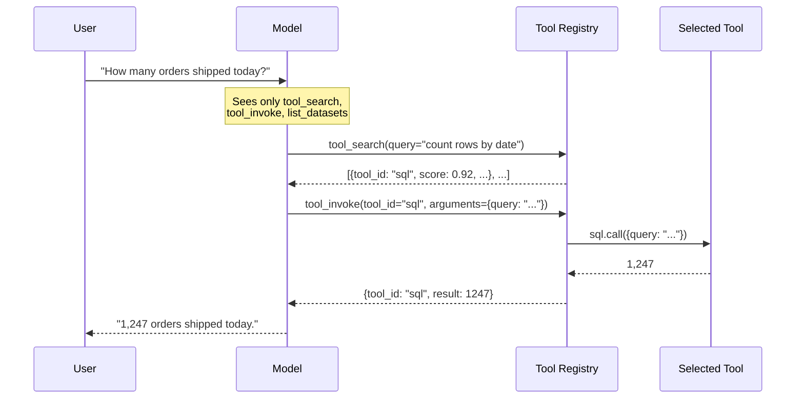

Spice provides tools that help LLMs interact with the runtime. To specify these tools for a Spice model, include them in its `params.tools`.

For a list of available tools, or how to define additional tools, see [Tool Components](../../components/tools).

### Tool Modes

The `tools` parameter on a model controls how tools are provided to the LLM:

| Value | Description |
| --- | --- |
| `auto` | Automatically choose between direct tools and searchable registry discovery. When the number of available tools exceeds 20 and an embedding model is available, `auto` switches to registry-based discovery; otherwise it uses direct tools. |
| `all` | Provide all built-in and Spicepod-configured tools directly to the LLM. |
| `search_registry` | Use searchable registry discovery. The LLM receives `tool_search` and `tool_invoke` meta-tools instead of individual tool definitions. Requires an embedding model (see `tool_embedding_model`). |
| `<tool1>, <tool2>, ...` | Provide only the named tools directly. |

### Example: Specifying Tools for a Model

```yaml
models:
  - name: sql-model
    from: openai:gpt-4o
    params:
      tools: list_datasets, sql, table_schema
```

### Example: Using all default tools directly

```yaml
models:
  - name: full-runtime
    from: openai:gpt-4o
    params:
      tools: all
```

### Example: Using auto mode (default)

```yaml
models:
  - name: full-runtime
    from: openai:gpt-4o
    params:
      tools: auto
```

For details on tool groups, see [Tool Components](../../components/tools#tool-groups).

### Tool Registry

#### Why the Tool Registry?

Each tool exposed to a model carries a name, a description, and a JSON Schema for its parameters. A typical tool is **200–500 tokens** of schema; a Spicepod with rich [MCP integrations](./mcp), several datasets exposed via `sql` / `table_schema` / `search`, and custom [user-defined functions](../functions) can quickly cross **50 tools** and **10,000+ tokens** of tool definitions injected into every chat turn.

That cost is paid on every request:

- **Tokens**: tool definitions are part of the system context, billed on every prompt.
- **Latency**: more input tokens = slower first-token times.
- **Accuracy**: research and practice both show LLM tool selection accuracy degrades when faced with dozens of similarly-named tools.
- **Context window**: tool definitions compete with conversation history, retrieved documents, and reasoning scratch space.

The **Tool Registry** addresses this by replacing every individual tool definition with just **two meta-tools**:

- **`tool_search(query, ...)`** — Searches the registry for tools relevant to a natural-language query. Returns the top N tools with their full schemas.
- **`tool_invoke(tool_id, arguments)`** — Invokes a tool returned by `tool_search`.

For a workload with 50 tools, this is roughly a **10× reduction** in tool-definition tokens injected per turn — the model now only sees the schemas of the tools it actively asks for.



`list_datasets` is always exposed directly alongside the meta-tools, so the model can orient itself ("what tables exist?") in a single call without first asking the registry.

#### Enabling the Registry

Set `tools: search_registry` to require registry-based discovery, or `tools: auto` to let Spice decide:

```yaml
embeddings:
  - name: tool_embeddings
    from: openai:text-embedding-3-small

models:
  - name: my-model
    from: openai:gpt-4o
    params:
      tools: search_registry
      tool_embedding_model: tool_embeddings
```

`tools: auto` switches to the registry **only when both** of these are true:

- The number of available tools exceeds **20** (`AUTO_SEARCH_TOOL_THRESHOLD`).
- An embedding model is available.

Otherwise `auto` falls back to providing tools directly — keeping small Spicepods ergonomic while large ones automatically benefit.

#### Configuring `tool_embedding_model`

The registry's vector channel uses a configured embedding model:

- **One embedding configured** → used automatically.
- **Multiple embeddings configured** → `tool_embedding_model` is required and must name one of them.
- **No embedding configured** → `tools: search_registry` is rejected; `tools: auto` falls back to direct tools with a warning log.

```yaml
embeddings:
  - name: openai_embed
    from: openai:text-embedding-3-small
  - name: local_embed
    from: huggingface:huggingface.co/sentence-transformers/all-MiniLM-L6-v2

models:
  - name: my-model
    from: openai:gpt-4o
    params:
      tools: search_registry
      tool_embedding_model: openai_embed # disambiguate
```

#### How `tool_search` Ranks Results

`tool_search` runs a **hybrid search** over four channels and fuses the results with [Reciprocal Rank Fusion (RRF)](../../reference/sql/search#reciprocal-rank-fusion-rrf):

| Channel     | Signal                                                                                       |
| ----------- | -------------------------------------------------------------------------------------------- |
| `full_text` | TF-IDF over tokenized tool name (×3 weight), description (×2), and parameters (×1).          |
| `keyword`   | Exact-phrase and token matches against name / description / parameter text. Weighted by where the match lands. |
| `schema`    | Matches against the **parameter keys** in the tool's JSON Schema (e.g. `dataset`, `query`).  |
| `vector`    | Cosine similarity between the query embedding and per-tool document embeddings.              |

Each channel produces a ranked list; RRF combines the ranks (not the scores) so a tool that places top-3 in two channels usually outranks one that places top-1 in a single channel. The final `score` is normalized to `0.0–1.0` against the highest-scoring tool in the result set.

Per-tool embeddings are computed lazily on first search and cached for the lifetime of the registry instance. The runtime keeps an LRU cache (up to 64 entries) of search-tool instances keyed on `(runtime, embedding model, tools hash)` so a Spicepod that hot-reloads tools without restarting the runtime doesn't pay the embedding cost repeatedly.

#### `tool_search` Parameters

The model calls `tool_search` with a JSON object:

| Parameter   | Type            | Description                                                                                  |
| ----------- | --------------- | -------------------------------------------------------------------------------------------- |
| `query`     | `string` (required) | Natural-language description of the capability the model needs.                              |
| `keywords`  | `string[]`      | Optional exact-match phrases that boost the keyword channel — useful for column or table names. |
| `limit`     | `integer`       | Maximum results to return. Defaults to **5**, capped at **20**.                              |
| `min_score` | `number`        | Optional minimum score (0.0–1.0). When the cutoff filters out everything, the connector still returns the unfiltered top match as a fallback so the model isn't left empty-handed. |

Example call (issued by the model):

```json
{
  "query": "count distinct values in a column",
  "keywords": ["distinct", "count"],
  "limit": 3
}
```

#### `tool_search` Response

```json
{
  "query": "count distinct values in a column",
  "keywords": ["distinct", "count"],
  "search_mode": "hybrid_rrf",
  "tools": [
    {
      "tool_id": "sql",
      "description": "Execute SQL queries on the runtime.",
      "parameters": { "type": "object", "properties": { "query": { "type": "string" } } },
      "score": 1.0,
      "matched_terms": ["count", "distinct", "sql"],
      "match_sources": [
        { "source": "full_text", "rank": 1, "score": 4.231 },
        { "source": "keyword", "rank": 1, "score": 9.0 },
        { "source": "vector", "rank": 1, "score": 0.812 }
      ]
    }
  ]
}
```

`match_sources` is intentionally surfaced — it lets the model (or a debugger) reason about *why* a tool was returned. A tool that only matched on `vector` but not `full_text` may be a semantic match for an unfamiliar phrasing; one that matched all four is a high-confidence hit.

#### `tool_invoke` Parameters

| Parameter   | Type     | Description                                                                                |
| ----------- | -------- | ------------------------------------------------------------------------------------------ |
| `tool_id`   | `string` | Tool name returned by `tool_search`.                                                       |
| `arguments` | `object` | JSON object matching the selected tool's parameter schema. Defaults to `{}`.               |

Example:

```json
{
  "tool_id": "sql",
  "arguments": { "query": "SELECT COUNT(DISTINCT customer_id) FROM orders" }
}
```

#### `tool_invoke` Response

```json
{
  "tool_id": "sql",
  "result": [{ "count": 1247 }]
}
```

Errors propagate the underlying tool's error message, prefixed with the `tool_id` so the model can decide whether to retry, ask for a different tool, or surface the failure to the user.

#### Reserved Tool Names and Conflicts

`tool_search` and `tool_invoke` are reserved names. If a user-defined tool or MCP tool registers under either name:

- **`tools: search_registry`** → fails at startup with a clear error.
- **`tools: auto`** → logs a warning and falls back to direct tools.

Rename the offending tool, or set `as_tool: false` to keep it SQL-only.

#### When to Use Direct Tools Instead

`tools: all` is the right choice when:

- The Spicepod has a small, focused tool set (under ~20 tools).
- The model needs to chain tools without round-tripping through `tool_search` (saves one tool call per turn).
- You want deterministic tool exposure for evaluation or compliance reasons.

For everything else — especially Spicepods that compose multiple MCP servers or expose dozens of dataset-bound tools — `tools: auto` is the recommended default.

### Example: Specifying tools and tool groups

```yaml
models:
  - name: full-runtime
    from: openai:gpt-4o
    params:
      tools: memory, sql
```

### Tool Recursion Limit

When a model requests to call a runtime tool, Spice runs the tool internally and feeds the result back to the model. The model may then request another tool call based on the result, creating a chain of tool invocations. The `tool_recursion_limit` parameter limits the depth of this internal recursion. By default, this limit is set to 10.

Lowering the limit can help prevent runaway tool chains in cases where a model repeatedly invokes tools without converging on a final answer.

```yaml
models:
  - name: my-model
    from: openai
    params:
      tool_recursion_limit: 3
```
