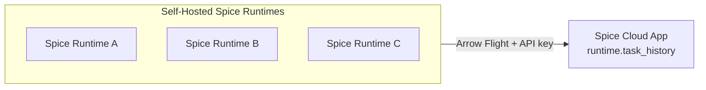

A self-hosted Spice runtime — running in Kubernetes, Docker, on a VM, or on a laptop — can connect to the [Spice Cloud Platform](https://spice.ai) to centralize [task history](../reference/task_history) across one or many runtimes. Once connected, query logs, refresh activity, AI tool invocations, and runtime errors from every connected instance are visible in a single SCP app, queryable as a standard `runtime.task_history` table, and retained beyond each runtime's local in-memory window.

The connection is configured declaratively in `spicepod.yaml` with a top-level `management:` block. No CLI command, sidecar, or extra agent is required — the runtime itself streams task history to SCP over Arrow Flight.



## What gets sent

The `management:` block enables a single export path: rows from the local [`runtime.task_history`](../reference/task_history) accelerated table are appended every 5 seconds to the `runtime.task_history` dataset of the target Spice Cloud app. Each row is a span representing one unit of execution — a SQL query, an AI chat completion, a dataset refresh, a tool call — including its inputs, outputs, duration, and error status.

The export covers a **rolling 3-day window** from the runtime's current time. Records older than 3 days are not backfilled when a runtime first connects.

The following are **not** sent through this path:

- Prometheus metrics — use the [Prometheus endpoint](../features/observability) or [OTLP exporter](../features/observability) for [Datadog](../datadog/index.md), [New Relic](../new-relic/index.md), Grafana, or any OTLP-compatible backend.
- Distributed traces — export to [Zipkin](../zipkin/index.md) or an OTLP tracing backend.
- Application logs — Spice writes logs to stdout/stderr; collect them with the platform's log shipper.

For a full observability stack on self-hosted deployments, combine `management:` with the metrics and tracing exporters above. `management:` covers task history; the others cover everything else.

## Prerequisites

- A [Spice Cloud Platform](https://spice.ai/login) account.
- A Spice Cloud app to receive task history. Apps are created from the Spice Cloud Console or via the CLI.
- An API key for that app.
- A self-hosted Spice runtime at v1.10.0 or later, with [task history enabled](../reference/task_history) (the default).

### Create an app and API key

From the Spice Cloud Console, create a new app (any name and visibility). Copy the API key shown on the app's settings page — it is only displayed at creation time and on demand from the **API Keys** tab.

To create the app from the CLI:

```bash
spice cloud login
spice cloud project create my-observability --kind set --region us-east-1 --visibility private
```

`--kind set` makes this a Spice-managed app; list the available regions with `spice cloud regions`. See [`spice cloud`](../cli/reference/cloud) for the full command reference.

The output includes the app's primary API key. Treat the key as a secret — anyone with the key can write task history to (and read it from) the app.

For an existing app, retrieve the current key with:

```bash
spice cloud api-keys --project <org>/<app>
```

## Configuration

Add a `management:` block to `spicepod.yaml` on each self-hosted runtime. The API key should be sourced from a [secret store](../components/secret-stores) rather than hard-coded.

### Minimal example

```yaml
version: v2
kind: Spicepod
name: my-runtime

management:
  api_key: ${secrets:SPICEAI_API_KEY}
```

With `SPICEAI_API_KEY` set in the environment (or `.env` file picked up by the [env secret store](../components/secret-stores/env)), the runtime connects to the default Spice Cloud region on startup. On success, the runtime logs:

```
INFO runtime::management: Connected to Spice Cloud for management and monitoring
```

### Selecting a region

By default, the runtime targets the Spice Cloud default region. To target a specific region, set `region` in `params`:

```yaml
management:
  api_key: ${secrets:SPICEAI_API_KEY}
  params:
    region: us-east-1
```

The region must match the region the API key was issued in. Available regions are listed in the Spice Cloud Console.

### Custom endpoint

For VPC-peered or otherwise-routed Cloud endpoints, override the Flight endpoint explicitly with `data_endpoint`:

```yaml
management:
  api_key: ${secrets:SPICEAI_API_KEY}
  params:
    data_endpoint: https://us-east-1-prod-aws-flight.spiceai.io
```

`data_endpoint` takes precedence over `region`. The scheme must be `https://` for production; `http://` is accepted for local testing only.

### Disabling without removing config

Set `enabled: false` to turn off the export without removing the block (useful for staging vs. production overrides):

```yaml
management:
  enabled: false
  api_key: ${secrets:SPICEAI_API_KEY}
```

## Reference

The `management:` block lives at the top level of `spicepod.yaml`, alongside `runtime:`, `datasets:`, and `models:`.

| Field            | Type    | Required | Default | Description                                                                                                  |
| ---------------- | ------- | -------- | ------- | ------------------------------------------------------------------------------------------------------------ |
| `enabled`        | boolean | No       | `true`  | Whether the management export is active. When `false`, the block is parsed but no connection is established. |
| `api_key`        | string  | Yes      | —       | API key for the target Spice Cloud app. Resolved through any [secret store](../components/secret-stores) via `${secrets:KEY}`. |
| `params.region`  | string  | No       | —       | Spice Cloud region (e.g. `us-east-1`). Used to build the Flight endpoint when `data_endpoint` is not set.    |
| `params.data_endpoint` | string  | No | Built from `region` | Flight endpoint URL override. Must be `https://` or `http://`. Takes precedence over `region`.        |

### Behavior

- **Transport:** Apache Arrow Flight over gRPC, authenticated with the API key via HTTP Basic on the Flight handshake.
- **Export interval:** Every 5 seconds. Records pending at runtime shutdown are flushed once more before the process exits.
- **Retention window:** Each export sends task history rows with an `end_time` within the last 3 days. Older rows are not backfilled.
- **Retry policy:** Failed exports use Fibonacci backoff with up to 10 retries before the export attempt is dropped (the next 5-second tick retries from scratch).
- **Task history dependency:** When `runtime.task_history.enabled` is `false`, the management export stays initialized but never sends data. Task history is enabled by default; see the [task history reference](../reference/task_history) for retention and capture options.

## Verification

After restarting the runtime, confirm the connection is established:

1. **Check the runtime log** for the connection line:

   ```
   INFO runtime::management: Connected to Spice Cloud for management and monitoring
   ```

   For deeper logging during setup, run with `RUST_LOG=runtime::management=debug`.

2. **Run a query** against the local runtime to generate task history:

   ```bash
   spice sql
   ```

   ```sql
   SELECT 1;
   ```

3. **Wait 5–10 seconds**, then query the target Spice Cloud app's task history. From any client logged in to Spice Cloud:

   ```bash
   spice sql --cloud <org>/<app>
   ```

   ```sql
   SELECT start_time, input, error_message
   FROM runtime.task_history
   ORDER BY start_time DESC
   LIMIT 10;
   ```

   The `SELECT 1` query issued on the self-hosted runtime appears in the result set.

## Connecting multiple runtimes

A single Spice Cloud app can receive task history from any number of self-hosted runtimes — share the same `api_key` across them. To distinguish runtimes when querying the consolidated table, tag each runtime in `spicepod.yaml`:

```yaml
name: edge-eu-west-1
runtime:
  params:
    deployment_label: edge-eu-west-1
```

The `name` field is recorded with every task history span and is the simplest way to filter:

```sql
SELECT spicepod_name, count(*) AS task_count
FROM runtime.task_history
WHERE start_time > now() - INTERVAL '1 hour'
GROUP BY spicepod_name
ORDER BY task_count DESC;
```

## Limitations

- **Task history only.** Metrics, traces, and logs are not exported through this path. Use the [observability features](../features/observability) or third-party [monitoring integrations](../index.md) for those signals.
- **3-day rolling window.** On first connect, only the last 3 days of task history are eligible. Older local history is not backfilled.
- **Append-only.** The export is one-way and append-only — the self-hosted runtime never reads from the Cloud table, and rows are not updated or deleted from the Cloud copy.
- **No live-reload of the API key.** Rotating the key requires restarting the runtime. Coordinate with the chosen secret store.
- **5-second export interval is not configurable.** The interval is a runtime constant.
- **API key auth only.** OIDC / SSO authentication is not supported on the management path.

## Troubleshooting

| Symptom                                                                                          | Likely cause                                                                  | Resolution                                                                                                                                                                                       |
| ------------------------------------------------------------------------------------------------ | ----------------------------------------------------------------------------- | ------------------------------------------------------------------------------------------------------------------------------------------------------------------------------------------------ |
| Startup error: `Missing required secret: api_key. Specify a value.`                              | `api_key` is empty or the referenced secret is not defined.                   | Ensure the secret store has the key and the `${secrets:...}` reference matches. Test secret resolution with `spice run` and the [env secret store](../components/secret-stores/env).          |
| Startup error: `Failed to create data connector for cloud management`                            | The Flight endpoint cannot be reached, or the API key is rejected.            | Verify outbound TLS connectivity to `https://<region>-prod-aws-flight.spiceai.io`. Regenerate the API key from the Spice Cloud Console; confirm `region` matches the key's region.               |
| No connection log line after restart                                                             | The `management:` block was not parsed — typically a YAML indentation issue.  | Confirm `management:` is at the top level of `spicepod.yaml`, not nested under `runtime:`. Check `spice run` startup logs for spicepod-parse warnings.                                            |
| Records never appear in the Cloud app                                                            | Task history is disabled, or the runtime hasn't run any spans yet.            | Confirm `runtime.task_history.enabled` is `true` (the default). Issue a query against the local runtime, then wait at least 5 seconds for the next export tick.                                  |
| `UNAUTHENTICATED` on Flight handshake                                                            | Wrong API key, key from a different app, or key from a different region.     | Regenerate the API key from the target app's **API Keys** tab and update the secret store. Verify `params.region` matches the app's region.                                                      |
| Repeated `Failed to export runtime task history records` warnings                                 | Transient network failure between the runtime and Spice Cloud.                | The runtime retries automatically on the next 5-second tick. If errors persist, check outbound network policy, DNS resolution, and the [Spice.ai status page](https://status.spice.ai).          |
| Records appear, but `spicepod_name` is empty for some runtimes                                   | The runtime's spicepod has no `name:` field.                                  | Set `name:` at the top of `spicepod.yaml` on each runtime so consolidated rows can be filtered.                                                                                                  |

For detailed export logging, set `RUST_LOG=runtime::management=trace` and watch for per-flush log lines like `Exported {n} task history records`.

## Related

- [Task History Reference](../reference/task_history) — schema, retention, and local querying.
- [Observability & Monitoring](../features/observability) — Prometheus metrics, OTLP export, and tracing.
- [Spice.ai Data Connector](../components/data-connectors/spiceai) — the underlying connector used for Cloud federation.
- [Secret Stores](../components/secret-stores) — managing the `api_key` securely.
- [Spice Cloud Platform Deployment](../deployment/cloud) — deploying applications on Spice Cloud.
