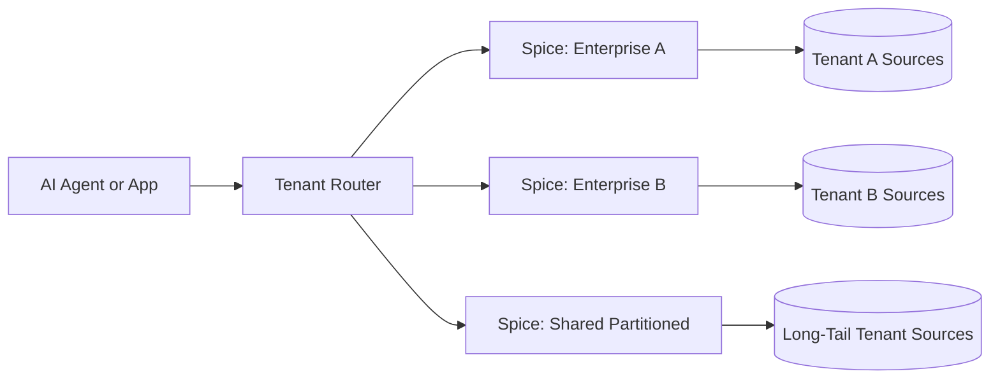

Spice serves as the data substrate for multi-tenant AI agents, giving each tenant real-time access to its own data sources with configurable isolation and no per-tenant ETL pipelines. A lightweight Rust runtime can be deployed once for all tenants, once per tenant, or in a hybrid topology, and every deployment exposes the same SQL, search, and AI inference APIs over HTTP, Arrow Flight, FlightSQL, ODBC, JDBC, and ADBC.



Pipeline-per-integration architectures collapse at scale: every tenant brings its own schema, refresh cadence, and ownership, and ETL orchestration becomes the bottleneck. Spice federates queries across 40+ data sources and accelerates them locally, so adding a tenant is a Spicepod configuration change rather than a new pipeline.

## Why Spice.ai?

- **Zero-ETL federation**: Query PostgreSQL, Snowflake, Databricks, S3, Kafka, and 25+ other sources through a single SQL interface. Onboarding a tenant is a dataset declaration, not a pipeline build.
- **Configurable isolation**: Choose logical, config-level, or runtime-level tenant boundaries. Isolation becomes a deployment property rather than something enforced in application code.
- **Sandboxed runtimes**: The Spice runtime is lightweight enough to deploy one instance per tenant or per agent, giving each agent its own sources, acceleration layers, and secrets.
- **Local acceleration with CDC**: Materialize tenant working sets into Arrow, DuckDB, SQLite, or PostgreSQL accelerators and keep them current with change data capture.
- **Declarative configuration**: The [`spicepod.yaml`](../../reference/spicepod) manifest defines datasets, models, secrets, and acceleration behavior, so tenant topology is version-controlled and auditable.

## Deployment Patterns

Four patterns trade off operational simplicity against isolation strength. Most SaaS workloads converge on a hybrid configuration.

### Pattern 1: Query-Time Tenant Isolation

One runtime serves many tenants. Datasets reference tenant-partitioned tables, and the application includes a tenant filter in every query.

```yaml
version: v1
kind: Spicepod
name: saas-shared

datasets:
  - from: postgres:public.events
    name: events
    params:
      pg_host: db.shared.internal
      pg_port: '5432'
      pg_db: app
      pg_user: ${secrets:PG_USER}
      pg_pass: ${secrets:PG_PASS}
    acceleration:
      enabled: true
      engine: arrow
      refresh_check_interval: 1s
```

This is the simplest and cheapest pattern to operate, but isolation is logical: correctness depends on every query path applying the tenant filter.

**View-based variant**: Move tenant filtering into the Spicepod using [views](../../reference/spicepod/views), so agents query a tenant-specific view rather than constructing the filter at runtime.

```yaml
datasets:
  - name: events
    from: postgres:public.events

views:
  - name: view_tenant_abc
    sql: "select * from events where tenant='tenant_abc'"
  - name: view_tenant_xyz
    sql: "select * from events where tenant='tenant_xyz'"
```

### Pattern 2: Config-Level Tenant Isolation

One runtime, but each tenant gets its own dataset entry. The manifest is typically generated from tenant-onboarding metadata.

```yaml
version: v1
kind: Spicepod
name: saas-many-datasets

datasets:
  - from: postgres:tenant_abc.events
    name: tenant_abc_events
    params:
      pg_host: db.pool.internal
      pg_db: app
      pg_user: ${secrets:PG_USER}
      pg_pass: ${secrets:PG_PASS}

  - from: postgres:tenant_xyz.events
    name: tenant_xyz_events
    params:
      pg_host: db.pool.internal
      pg_db: app
      pg_user: ${secrets:PG_USER}
      pg_pass: ${secrets:PG_PASS}
```

Tenant boundaries are explicit in configuration and easier to audit, but the manifest grows with tenant count and reload time and memory planning become operational concerns at large scale.

### Pattern 3: Runtime-Level Tenant Isolation

Run a dedicated Spicepod per tenant and route requests using tenant context from auth or session claims. Each runtime has an independent manifest, compute envelope, and cache.

```yaml
version: v1
kind: Spicepod
name: tenant-abc

datasets:
  - from: postgres:public.events
    name: events
    params:
      pg_host: tenant-abc-db.internal
      pg_db: app
      pg_user: ${secrets:PG_USER}
      pg_pass: ${secrets:PG_PASS}
    acceleration:
      enabled: true
      engine: duckdb
      mode: file
      refresh_check_interval: 1s
      params:
        duckdb_file: /var/lib/spice/tenant-abc.db
```

This gives the clearest isolation model and per-tenant operational control, at the cost of higher operational overhead as tenant count grows. It fits regulated workloads that require strict data boundaries.

### Pattern 4: Hybrid Isolation

Large tenants run on dedicated Spicepods while the long tail shares a partitioned deployment. A tenant-aware router decides placement and clients query a single logical interface.

```yaml
# router config (conceptual)
tenants:
  - id: enterprise-abc
    spicepod: spicepod-tenant-abc
  - id: enterprise-xyz
    spicepod: spicepod-tenant-xyz

default:
  spicepod: spicepod-shared
```

Hybrid isolation keeps the query interface stable while allowing tenant placement by policy, isolating high-load or regulated tenants on dedicated runtimes and using shared capacity for the long tail. It is the recommended starting point for variable SaaS workloads.

## Choosing a Pattern

The right shape depends on isolation requirements, tenant count, and query volume per tenant.

| Requirement | Recommended Pattern |
| --- | --- |
| Small tenant count, uniform workload | Pattern 1 or 1-view |
| Explicit config-level boundaries, auditable manifest | Pattern 2 |
| Regulated tenants, strict per-tenant SLOs | Pattern 3 |
| Power-law tenant distribution | Pattern 4 (hybrid) |

## Benefits

- **Zero-ETL onboarding**: Add a tenant by declaring a dataset, not by building a pipeline.
- **Deployment-level isolation**: Match isolation strength to business and compliance requirements without changing application code.
- **Consistent interface**: Agents query SQL, search, and inference APIs the same way regardless of how tenants are partitioned underneath.

## Learn More

- [Multi-Tenancy for AI Agents without the Pipelines](https://spice.ai/blog/multi-tenancy-for-ai-agents-without-pipelines) — the engineering deep dive behind these patterns.
- [Spicepod reference](../../reference/spicepod) and [datasets reference](../../reference/spicepod/datasets).
- [Views](../../reference/spicepod/views) for declarative tenant filtering.
- [Data Acceleration](../../features/data-acceleration) and [Change Data Capture](../../features/data-acceleration/data-refresh).
- [Federated SQL Query recipe](https://github.com/spiceai/cookbook/blob/trunk/federation/README.md).
