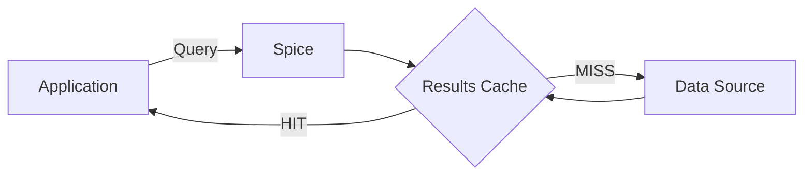

Spice.ai provides a read-through caching pattern through the SQL results cache. When a query is executed, the result is stored in an in-memory cache. Identical queries within the TTL window are served directly from memory without re-executing against the upstream data source. This works for both federated data sources (PostgreSQL, MySQL, S3, etc.) and HTTP API datasets.

For HTTP-based datasets, Spice also supports a dataset-level `refresh_mode: caching` that fetches data from the upstream API on cache miss and stores it in the local accelerator. The SQL results cache operates on top of this, adding a fast in-memory layer for repeated SQL queries.



## Federated Data Sources

For datasets without acceleration enabled, queries are federated directly to the upstream source. The SQL results cache stores the output of these queries in memory, so that identical queries within the TTL return instantly without a network round-trip to the source.

This is effective for dashboards, reporting queries, or any workload where the same query is executed repeatedly within a short window against a remote database.

```yaml
datasets:
  - from: postgres:production.public.customers
    name: customers

runtime:
  caching:
    sql_results:
      enabled: true
      item_ttl: 30s
      stale_while_revalidate_ttl: 5m
```

The first execution of `SELECT * FROM customers WHERE region = 'us-west'` federates the query to PostgreSQL. The result is cached in memory. Identical queries within 30 seconds return from the cache (`HIT`). Between 30 seconds and 5 minutes 30 seconds, stale results are served immediately (`STALE`) while Spice re-executes the query against the upstream source in the background. After 5 minutes 30 seconds without access, the entry is evicted and the next query is a `MISS`.

### Configuration

```yaml
runtime:
  caching:
    sql_results:
      enabled: true              # Default: true
      max_size: 256MiB           # Default: 128MiB
      item_ttl: 30s              # Default: 1s
      stale_while_revalidate_ttl: 5m  # Default: 0s (disabled)
      eviction_policy: lru       # lru (default) or tiny_lfu
      cache_key_type: plan       # plan (default) or sql
      encoding: zstd             # none (default) or zstd
```

| Parameter                    | Default | Description                                                                                                     |
| ---------------------------- | ------- | --------------------------------------------------------------------------------------------------------------- |
| `item_ttl`                   | `1s`    | Duration a cached entry is considered fresh.                                                                    |
| `stale_while_revalidate_ttl` | `0s`    | Grace period to serve stale entries while re-executing the query in the background.                             |
| `eviction_policy`            | `lru`   | Cache replacement policy. `tiny_lfu` provides higher hit rates for skewed access patterns.                      |
| `cache_key_type`             | `plan`  | `plan` matches semantically equivalent queries. `sql` matches only identical SQL strings (faster but stricter). |
| `encoding`                   | `none`  | `zstd` compresses cached results to fit more entries in memory.                                                 |

### Cache-Control

Clients can control cache behavior per-request using the `Cache-Control` header (HTTP/Flight API) or the `--cache-control` flag (Spice SQL REPL):

```bash
# Bypass cache and fetch fresh from upstream
curl -H "cache-control: no-cache" -XPOST http://localhost:8090/v1/sql \
  -d "SELECT * FROM customers WHERE region = 'us-west'"

# Only return cached results; error on cache miss
curl -H "cache-control: only-if-cached" -XPOST http://localhost:8090/v1/sql \
  -d "SELECT * FROM customers WHERE region = 'us-west'"

# Accept stale results up to 60 seconds old
curl -H "cache-control: max-stale=60" -XPOST http://localhost:8090/v1/sql \
  -d "SELECT * FROM customers WHERE region = 'us-west'"
```

The `Results-Cache-Status` response header indicates cache state: `HIT`, `MISS`, `BYPASS`, or `STALE`.

## HTTP Data Sources

For HTTP-based datasets, Spice provides dataset-level caching with `refresh_mode: caching`. On a cache miss, Spice fetches data from the upstream API, returns it to the caller, and stores it in the local accelerator. The SQL results cache adds an in-memory layer on top, caching the output of SQL queries against the accelerated data.

```yaml
datasets:
  - from: https://api.tvmaze.com
    name: tv_search_cache
    params:
      file_format: json
      allowed_request_paths: '/search/shows'
      request_query_filters: enabled
    acceleration:
      enabled: true
      refresh_mode: caching
      engine: cayenne
      mode: file
      params:
        caching_ttl: 30s
        caching_stale_if_error: enabled

runtime:
  caching:
    sql_results:
      enabled: true
      item_ttl: 10s
```

In this configuration:

1. The first query fetches from the upstream API and caches the response in the accelerator.
2. The query result is also stored in the in-memory SQL results cache.
3. Identical SQL queries within 10 seconds are served from memory without touching the accelerator.
4. After 10 seconds, the query re-executes against the accelerator (still serving from the dataset cache if within the 30-second `caching_ttl`).

### HTTP Dataset Cache Parameters

| Parameter                            | Default    | Description                                                                                       |
| ------------------------------------ | ---------- | ------------------------------------------------------------------------------------------------- |
| `caching_ttl`                        | `0s`       | Duration a cached entry in the accelerator is considered fresh.                                   |
| `caching_stale_while_revalidate_ttl` | `0s`       | Duration after TTL expiry during which stale data is served while revalidating in the background. |
| `caching_stale_if_error`             | `disabled` | When `enabled`, serves stale cached data if the upstream fetch fails.                             |

:::warning
Do not configure `stale_while_revalidate_ttl` on both the SQL results cache (`runtime.caching.sql_results`) and the dataset caching accelerator (`acceleration.params.caching_stale_while_revalidate_ttl`) for the same dataset. Use one or the other to avoid conflicting revalidation behavior.
:::

## Benefits

- **Read-Through for Any Source**: The SQL results cache provides read-through semantics for any data source — federated databases, accelerated datasets, or HTTP APIs — with no application code changes.
- **Reduced Upstream Load**: Repeated queries are served from the in-memory cache, protecting upstream databases and APIs from read amplification.
- **Stale-While-Revalidate**: Expired entries are served immediately while Spice refreshes data in the background, avoiding latency spikes.
- **Resilience**: For HTTP sources, `stale_if_error` keeps the application functional during upstream outages.

### Learn More

- **Caching**: [Documentation](../../features/caching) for SQL results cache configuration, Cache-Control directives, stale-while-revalidate behavior, and response headers.
- **Caching Refresh Mode**: [Documentation](../../features/data-acceleration/refresh-modes/caching) for HTTP dataset-level caching configuration.
- **HTTP(s) Data Connector**: [Documentation](../../components/data-connectors/https) for HTTP-specific parameters like `allowed_request_paths` and request filters.
- **Data Acceleration**: [Documentation](../../features/data-acceleration) for acceleration engines and modes.
