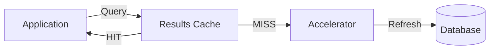

Spice.ai caches SQL database data at two layers: dataset acceleration, which materializes upstream tables into a fast local engine, and SQL results caching, which stores query results in memory for repeated queries.

Together, these layers reduce load on upstream databases and deliver sub-millisecond query performance. Dataset acceleration is suited for working sets that applications query repeatedly, while results caching handles identical SQL queries across short time windows — for example, a dashboard that multiple users hit with the same query within seconds.



## Why Spice.ai?

- **Dataset Acceleration**: Materializes tables from PostgreSQL, MySQL, or other SQL connectors into a local accelerator (Cayenne, DuckDB, SQLite, Arrow), with configurable refresh intervals or CDC-based change tracking.
- **SQL Results Cache**: Caches query results in memory with LRU eviction, configurable TTL, and stale-while-revalidate support. Enabled by default for HTTP and Arrow Flight SQL APIs.
- **Reduced Upstream Load**: Repeated queries are served from the local cache or accelerator without hitting the upstream database, protecting production databases from read amplification.
- **CDC Support**: Debezium-based change data capture keeps the accelerated copy in sync with the source database in near-real-time, without polling.

## Example

### Dataset Acceleration

Accelerate a PostgreSQL table locally with periodic refresh:

```yaml
datasets:
  - from: postgres:production.public.customers
    name: customers
    acceleration:
      enabled: true
      engine: cayenne
      refresh_check_interval: 1m
```

With CDC-based refresh using Debezium:

```yaml
datasets:
  - from: debezium:cdc.public.orders
    name: orders
    acceleration:
      enabled: true
      engine: duckdb
      mode: file
      refresh_mode: changes
```

### SQL Results Cache

Enable the SQL results cache with a longer TTL and stale-while-revalidate for dashboard workloads:

```yaml
runtime:
  caching:
    sql_results:
      enabled: true
      max_size: 512MiB
      item_ttl: 30s
      stale_while_revalidate_ttl: 5m
      eviction_policy: lru
```

With this configuration, the first execution of a query runs against the accelerated table, and the result is cached in memory. Identical queries within 30 seconds are served from the in-memory cache. After 30 seconds, the cached result is served stale while Spice re-executes the query in the background. After 5 minutes 30 seconds without access, the entry is evicted.

The `Results-Cache-Status` response header indicates cache state for each query:

| Value    | Meaning                                                   |
| -------- | --------------------------------------------------------- |
| `HIT`    | Result served from the cache.                             |
| `MISS`   | No cached result; query executed against the accelerator. |
| `STALE`  | Stale result served while revalidating in the background. |
| `BYPASS` | Cache bypassed by client request.                         |

Clients can control cache behavior per-request using the `Cache-Control` header (HTTP API) or `--cache-control` flag (Spice SQL REPL). For example, `Cache-Control: no-cache` bypasses the cache for a single request while still caching the result for future queries. `Cache-Control: only-if-cached` returns only cached results, erroring on a miss.

## Benefits

- **Sub-Millisecond Reads**: Accelerated data is colocated with the application, eliminating network round-trips to the source database.
- **Production Database Protection**: Both caching layers absorb read traffic, keeping upstream database load predictable.
- **Freshness Control**: Choose between periodic refresh, CDC, or query-level TTL depending on the consistency requirements.

### Learn More

- **Data Acceleration**: [Documentation](../../features/data-acceleration) and [Data Refresh](../../features/data-acceleration/data-refresh).
- **Caching**: [Documentation](../../features/caching) for SQL results cache configuration and parameters.
- **CDC**: [Documentation](../../features/cdc) for Debezium-based change data capture.
- **CQRS Cookbook**: [Recipe](https://github.com/spiceai/cookbook/tree/trunk/cqrs#readme) for command-query separation patterns with Spice.
