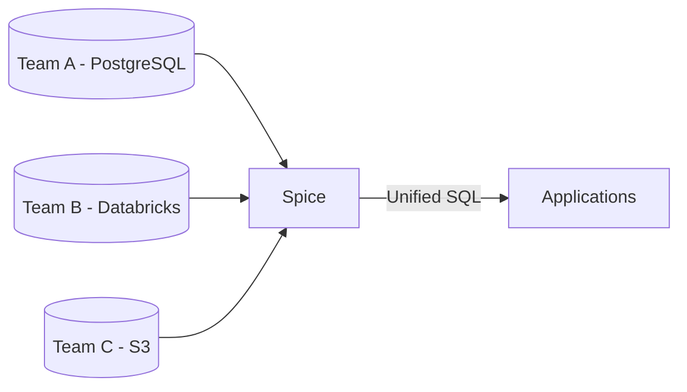

Spice supports data mesh architectures by giving domain teams decentralized, real-time data access through a unified SQL interface. Each team manages its own datasets while Spice federates and accelerates queries across all sources, removing the need for centralized data pipelines.



## Why Spice.ai?

- **Federated SQL Queries**: Query disparate sources (PostgreSQL, Databricks, S3, on-premises systems) through a single SQL interface. Domain teams access their own data without relying on a central data team.
- **Local Acceleration**: Materialize domain-specific datasets near applications using CDC-based refresh, delivering low-latency access without copying data into a central warehouse.
- **Governance**: Integrates with Databricks Unity Catalog for role-based access control and credential vendoring, so teams maintain security and compliance without custom infrastructure.
- **Observability**: End-to-end visibility into data flows and query performance across domains, simplifying monitoring and debugging.

## Example

An organization runs multiple teams, each owning their data in separate systems — one team in PostgreSQL, another in Databricks, a third in S3. Spice federates all three sources and accelerates frequently queried datasets locally, so any application can query across domains with consistent performance.

### Example Configuration

```yaml
datasets:
  - from: postgres:team_a.customers
    name: customers
    acceleration:
      enabled: true
      engine: duckdb

  - from: databricks:team_b.transactions
    name: transactions
    acceleration:
      enabled: true
      engine: duckdb
      mode: file
      refresh_mode: changes

  - from: s3://team-c-data/reports/
    name: reports
    params:
      file_format: parquet
    acceleration:
      enabled: true
```

This configuration federates customer data from PostgreSQL, transaction data from Databricks (with CDC refresh), and report data from S3, accelerating all three locally for unified access. The [Federated SQL Query recipe](https://github.com/spiceai/cookbook/blob/trunk/federation/README.md) demonstrates unified data access patterns for such scenarios.

## Benefits

- **Decentralization**: Teams own and manage their own data while applications query a single endpoint.
- **Performance**: Local acceleration delivers consistent low-latency queries across all domains.
- **Governance**: Centralized access control without centralized data infrastructure.

### Learn More

- **Federated SQL Queries**: [Documentation](../../features/query-federation) and [Federated SQL Query Recipe](https://github.com/spiceai/cookbook/blob/trunk/federation/README.md).
- **Data Acceleration**: [Documentation](../../features/data-acceleration) and [DuckDB Data Accelerator Recipe](https://github.com/spiceai/cookbook/blob/trunk/duckdb/accelerator/README.md).
- **Observability**: [Documentation](../../features/observability).
