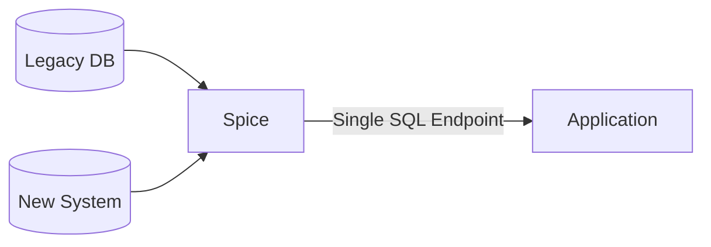

Spice federates legacy and modern data systems without ETL, supporting data migrations and cross-system workflows with zero application downtime. Applications query a single SQL endpoint that spans both old and new systems, making migrations incremental and reversible.



## Why Spice.ai?

- **Single Endpoint**: Applications connect to one SQL interface regardless of how many backend systems are involved. Migrating from one database to another requires no application code changes.
- **No Data Movement**: Federated queries read from each source directly, avoiding the cost and risk of bulk data replication during migrations.
- **Acceleration**: Frequently accessed data is materialized locally for low-latency queries, so performance stays consistent even while backend systems are being migrated.
- **Observability**: Built-in monitoring tracks query performance and data freshness across all sources, giving visibility into migration progress.

## Example

An application migrates from a legacy PostgreSQL database to a cloud-native system. During the transition, Spice federates both sources so the application queries a single endpoint. Data from the legacy system is accelerated locally to maintain performance while traffic shifts to the new backend.

### Example Configuration

```yaml
datasets:
  - from: postgres:legacy_db.orders
    name: legacy_orders
    acceleration:
      enabled: true
      engine: duckdb

  - from: mysql:new_system.orders
    name: new_orders
    acceleration:
      enabled: true
      engine: duckdb
```

This configuration federates order data from both the legacy PostgreSQL database and the new MySQL system, accelerating both locally in DuckDB for consistent query performance.

## Benefits

- **Zero Downtime**: Applications keep working during migrations — no staged cutovers or maintenance windows required.
- **Incremental Migration**: Move tables one at a time while the application queries both systems transparently.
- **Lower Risk**: No bulk data replication means fewer failure modes and easier rollback.

### Learn More

- **Federated SQL Queries**: [Documentation](../../features/query-federation) and [Federated SQL Query Recipe](https://github.com/spiceai/cookbook/blob/trunk/federation/README.md).
- **Data Acceleration**: [Documentation](../../features/data-acceleration) and [DuckDB Data Accelerator Recipe](https://github.com/spiceai/cookbook/blob/trunk/duckdb/accelerator/README.md).
- **Observability**: [Documentation](../../features/observability).
