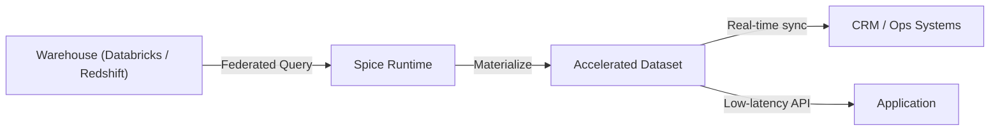

Spice.ai syncs enriched data from warehouses to operational systems like CRMs for real-time actions, eliminating complex ETL pipelines.

Unlike data-team-focused orchestration tools (e.g., Fivetran, Airbyte), Spice.ai targets developers by providing a unified query layer and native Databricks integration, simplifying data flow into operational systems with enterprise-grade governance.

## Why Spice.ai?

- **Unified Access**: Queries across Databricks, Redshift, and on-premises databases without custom connectors, streamlining workflows compared to ETL-heavy tools requiring extensive configuration.
- **Real-Time Updates**: Change Data Capture (CDC) ensures operational systems reflect warehouse data instantly, avoiding the delays of scheduled ETL jobs that disrupt time-sensitive workflows.
- **Governance**: Native Databricks Unity Catalog integration provides role-based security and credential vendoring, ensuring compliance where standalone reverse-ETL tools fall short.
- **Performance**: Materializes transformed datasets for low-latency access, reducing operational bottlenecks compared to traditional data pipelines.

## Example

A SaaS company syncs customer usage data from a Databricks lakehouse to a Salesforce CRM, enabling real-time account health scoring for sales teams. This reduces integration time from weeks to days compared to traditional ETL tools, allowing faster response to customer needs. The [DuckDB Data Accelerator recipe](https://github.com/spiceai/cookbook/blob/trunk/duckdb/accelerator/README) provides a practical guide to materializing datasets for such workflows.

## Benefits

- **Efficiency**: Eliminates ETL pipeline maintenance, freeing developers for core application logic.
- **Consistency**: Ensures operational systems have up-to-date data, improving decision accuracy.
- **Security**: Leverages enterprise-grade governance, critical for regulated industries like finance or healthcare.

### Learn More

- **Federated SQL Queries**: [Documentation](../../features/query-federation) and [Federated SQL Query Recipe](https://github.com/spiceai/cookbook/blob/trunk/federation/README).
- **Data Acceleration**: [Documentation](../../features/data-acceleration) and [DuckDB Data Accelerator Recipe](https://github.com/spiceai/cookbook/blob/trunk/duckdb/accelerator/README).
- **Observability**: [Documentation](../../features/observability).
