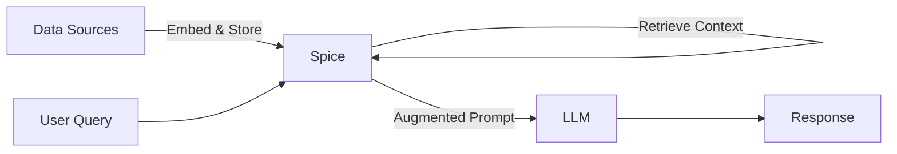

Use Spice to access data across various data sources for Retrieval-Augmented-Generation (RAG).

Spice enables developers to combine structured data via SQL queries and unstructured data through built-in vector similarity search. This combined data can then be fed to large language models (LLMs) through a native AI gateway, improving the models' ability to generate accurate and contextually relevant responses.



## Example Configuration

The following `spicepod.yaml` configures a dataset with vector embeddings and an OpenAI model for RAG:

```yaml
datasets:
  - from: s3://my-bucket/documents/
    name: documents
    params:
      file_format: parquet
    columns:
      - name: content
        embeddings:
          - from: openai
    acceleration:
      enabled: true

embeddings:
  - from: openai
    name: openai
    params:
      openai_api_key: ${ env:OPENAI_API_KEY }

models:
  - from: openai:gpt-4o
    name: rag_model
    params:
      openai_api_key: ${ env:OPENAI_API_KEY }
      tools: auto
```

For more details on using vector search, embeddings, and model providers, refer to the following documentation:

- [Vector-Based Search](../../features/search/vector-search)
- [Embedding Models](../../components/embeddings)
- [Model Providers](../../components/models)
