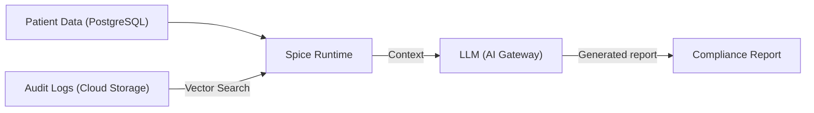

Spice.ai generates dynamic, context-aware AI-driven reports for operational insights in health-tech/healthcare, ensuring compliance and precision in regulated environments.

Unlike traditional reporting tools (e.g., Tableau, Power BI) or generic RAG frameworks (e.g., LlamaIndex) that lack real-time data federation and robust governance, Spice.ai combines enterprise-grade data access, vector search, and AI integration to deliver precise, real-time reports tailored to healthcare’s stringent requirements, surpassing generic solutions in accuracy and trustworthiness.

## Why Spice.ai?

- **Vector Similarity Search (VSS)**: Retrieves unstructured data (e.g., audit logs, regulatory guidelines) and embeddings efficiently, enabling semantic context for compliance-focused reports, critical for healthcare applications.
- **AI Gateway**: Produces narrative, human-readable reports from complex datasets using large language models (LLMs), supporting hosted (e.g., OpenAI) and local (e.g., Llama) models for privacy and cost efficiency in healthcare.
- **Federated Access**: Queries diverse data sources (e.g., Databricks, PostgreSQL, on-premises systems) in real time, providing a unified view for comprehensive reporting, unlike siloed reporting tools that limit data scope.
- **Semantic Models**: Aligns AI-generated insights with enterprise data, ensuring compliance and accuracy, reducing risks of irrelevant outputs in regulated healthcare environments.

## Example

A health-tech company generates real-time HIPAA compliance reports by combining structured patient data from PostgreSQL with unstructured audit logs and regulatory guidelines from cloud storage. The AI Gateway produces narrative summaries highlighting potential violations and actionable recommendations, delivered to compliance officers in minutes. This outperforms static BI dashboards and generic RAG tools lacking real-time integration and regulatory context, ensuring faster, more accurate compliance decisions. The [Vector-Based Search documentation](../../features/search/vector-search) provides guidance for implementing VSS in RAG workflows.

## Benefits

- **Compliance**: Governed data access meets stringent healthcare regulatory standards, ensuring auditability and trust.
- **Timeliness**: Real-time data federation delivers up-to-date reports for rapid compliance and operational decisions.
- **Insightfulness**: AI-driven narratives provide context-rich, actionable insights, enhancing healthcare operational efficiency.

### Learn More

- **Vector Similarity Search**: [Documentation](../../features/search) and [Searching GitHub Files Recipe](https://github.com/spiceai/cookbook/blob/trunk/search_github_files/README).
- **AI Gateway**: [Documentation](../../features/large-language-models) and [Running Llama3 Locally Recipe](https://github.com/spiceai/cookbook/blob/trunk/llama/README).
- **Federated SQL Queries**: [Documentation](../../features/query-federation) and [Federated SQL Query Recipe](https://github.com/spiceai/cookbook/blob/trunk/federation/README).
- **Semantic Model**: [Documentation](../../features/semantic-model).
