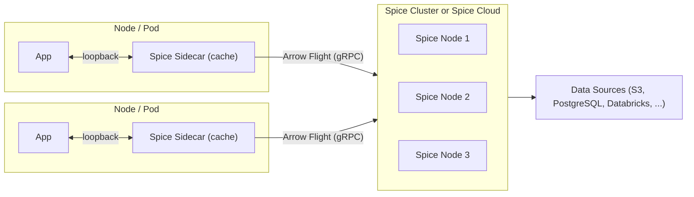

Modern applications have two fundamentally different data access patterns, and no single deployment model serves both well. Large analytical queries — scanning terabytes of Iceberg data, joining Delta Lake tables, running cross-dataset aggregations — need distributed execution across many nodes. Hot operational queries — serving the working set a microservice actually uses, answering user-facing requests in under 5 milliseconds, feeding fresh context to an AI agent — need data materialized right next to the application, with no network hop.

Those workloads share a third requirement: **isolation**. Giving an application — especially an AI agent that writes its own queries — direct credentials to production Postgres, a data lake, or a warehouse means a bad plan, a runaway loop, or a prompt injection can exhaust connection pools, scan petabytes, or touch rows it shouldn't. The retrieval layer needs to be a sandbox, not a passthrough.


The [cluster-sidecar architecture](https://spice.ai/blog/cluster-sidecar-architecture) addresses all three. Application sidecars handle the hot path with a scoped, locally accelerated working set, while a centralized Spice [cluster](./cluster) (or the [Spice Cloud Platform](./hosted)) provides distributed compute for heavy queries, data ingestion, acceleration, and refresh. When a sidecar needs to reach beyond its materialized working set — a historical query, a cross-dataset join, a broad search — it transparently delegates to the cluster over Arrow Flight, which executes the query and returns results. The sidecar can then cache those results for future use.

From the application's perspective, everything is `localhost`. From an infrastructure perspective, the system delivers the throughput of a distributed query engine, the latency of an embedded database, and a hard isolation boundary between the application and origin data systems — without ETL between them, sync jobs, or consistency gaps.

Think of it as a [CDN for your data](../../use-cases/data/database-cdn): the cluster is the origin server, the sidecars are the edge nodes, and Spice handles the caching, invalidation, and routing. Origin databases, data lakes, and CDC streams never see the application fleet.



Each sidecar is configured declaratively via a `spicepod.yaml` — the datasets, views, acceleration engines, search indices, and AI models it manages. Sidecars start in seconds, typically run on a few hundred megabytes of memory, and scale horizontally with application pods: scale a deployment from 5 to 50 replicas and 50 sidecars come up automatically, each materializing only the working set its spicepod declares. Sidecars never talk to each other; they only talk to the cluster.

For the engineering walkthrough of this pattern, including a request-path example and FAQ, see [Localhost Latency at Scale: The Spice Cluster-Sidecar Architecture](https://spice.ai/blog/cluster-sidecar-architecture).

## How it works

### The sidecar as a sandbox

The most important property of the sidecar is isolation, not just latency. The sidecar is the only data-plane surface the application touches:

- **Scoped working set.** A sidecar's `spicepod.yaml` declares exactly which datasets, views, and search indices the application may query. Anything not declared is physically absent from the catalog — not filtered by a policy, not hidden by a row-level rule. Compare this with row-level security, where the underlying data is still present and a single policy misconfiguration can expose it. Even a perfectly crafted prompt injection cannot query a table that is not in the catalog.
- **No origin credentials in the application.** The application connects to its sidecar with a local token. The sidecar connects to the cluster over Arrow Flight. Only the cluster holds credentials for Postgres, Snowflake, Databricks, S3, Kafka, and the rest. Compromising an application pod cannot leak origin credentials, because the pod never had them.
- **Narrow network surface.** The application's only outbound data dependency is the loopback interface. Network policy can pin the sidecar's egress to the cluster endpoint only.
- **Per-application data views.** Sidecars can be specialized per application class or per tenant. A customer-service agent, a fraud-review agent, and an internal dashboard can each run with different spicepods pointing at different slices of the same cluster. This is physical isolation, not policy-based filtering on a shared database. See [Multi-Tenant AI Agents](../../use-cases/ai/multi-tenant-agents).
- **Bounded resource use.** A rogue query plan or runaway loop exhausts the sidecar's local memory and CPU budget, not the cluster's and not the origin database's.
- **Local inference.** Sidecars can serve [LLM inference and tool calls](../../features/large-language-models) on loopback so sensitive prompts and retrieved context stay in the pod. Heavier models can still be routed to the cluster.
- **One audit point.** Every query, search, and inference call flows through the sidecar, so there is one place to log, rate-limit, and enforce policy.

Data only moves along one path: **application → sidecar → (optionally) cluster → origin**. It never skips a tier.

### Three latency tiers

A request is served from the first tier that can answer it:

1. **Sidecar results cache** — repeat queries return from the in-memory [results cache](../../features/caching) in microseconds (`Results-Cache-Status: HIT`).
2. **Sidecar working set** — novel queries that fit the locally materialized dataset execute on-node in single-digit milliseconds (Arrow, DuckDB, or SQLite).
3. **Cluster delegation** — queries that exceed the working set are forwarded to the cluster. [Apache Ballista](../../features/distributed-query) distributes execution; [Spice Cayenne](../../components/data-accelerators/cayenne) accelerates large scans. The sidecar caches the result so subsequent reads drop back to tier 1.

The cluster has its own results cache, so one sidecar's miss can become a cluster cache hit for every subsequent sidecar. Typical application-visible latency: p50 at tier 1, p95 at tier 2, tail at tier 3.

Useful cache knobs in this topology:

- `cache_key_type: plan` (default) shares a cache entry across semantically equivalent SQL, which matters for ORM-generated queries. `sql` is a faster, string-exact lookup.
- `stale_while_revalidate_ttl` lets the sidecar serve a stale cached result immediately while a background refresh runs.
- Clients can send `Cache-Control` directives per request (`no-cache`, `only-if-cached`, `stale-if-error`).
- `encoding: zstd` typically cuts results-cache memory by 50–90%.

### The cluster ingests once

Refreshing from upstream sources, running Cayenne acceleration on large Iceberg tables, and keeping CDC streams connected are resource-intensive. Doing any of that *N* times for *N* sidecars is wasteful and often infeasible — source systems have connection limits, and per-pod CDC multiplies cloud cost with fleet size.

The cluster ingests each dataset once and produces one authoritative materialization. Source load is bounded by cluster size, not fleet size. A new pod's sidecar pulls its working set from the cluster (or from an [acceleration snapshot](../../features/data-acceleration/snapshots)) rather than re-scanning the source, so new nodes are operational in seconds.

Sidecars stay lightweight because they do **not** own ingest:

- They start in seconds — important when application pods autoscale with traffic.
- They typically run on a few hundred megabytes of memory.
- Scaling from 5 to 50 replicas does **not** add 50 new connections to the source database.
- Each sidecar materializes only the working set its spicepod declares, not a full copy of the warehouse. Full accelerated datasets stay on the cluster.

### Query delegation over Arrow Flight

Sidecar-to-cluster communication is [Arrow Flight](https://arrow.apache.org/docs/format/Flight.html) over gRPC. Results flow as Arrow record batches directly into the sidecar's query engine with no JSON or row-based serialization detour.

The sidecar decides locally whether a query can be served from its working set. If not, it forwards and streams results back. The application sees one endpoint and one query. It never knows whether execution happened locally or whether Ballista fanned the query out across cluster executors.

Configure delegation with the [Spice.ai Data Connector](../../components/data-connectors/spiceai): point a sidecar dataset at a Spice Cloud app (`spice.ai/<org>/<app>/datasets/<name>`) or at a self-hosted cluster (`spice.ai:https://cluster.example:50051`). Combine with local acceleration to materialize the hot working set; leave acceleration off to always delegate.

Kubernetes is the most common place to run this topology, but it is not required. The architecture needs only a network path from each sidecar to the cluster. Sidecars run wherever the application runs — Kubernetes, a VPC, on-prem, or at the edge.

### Acceleration snapshots

The cluster-sidecar split maps onto [acceleration snapshots](../../features/data-acceleration/snapshots) as a single-writer / many-reader topology:

- The **cluster** is the single writer (`snapshots: create_only`). After each refresh it uploads a snapshot to object storage. It never downloads snapshots on startup; it always refreshes from the source.
- Each **sidecar** is a reader (`snapshots: bootstrap_only`). On startup — or when ephemeral NVMe is recycled — the sidecar downloads the most recent snapshot and is immediately ready. It never writes snapshots back.

This avoids snapshot conflicts, keeps the cluster as the authoritative refresh point, and gives every sidecar a warm start from the same materialization. For CDC-backed datasets with large initial state, the difference between a snapshot bootstrap and a full re-sync can be seconds versus minutes.

Use DuckDB or SQLite in `mode: file` on the sidecar when snapshots are in play — snapshots persist and restore the acceleration file itself. Heavyweight [Cayenne](../../components/data-accelerators/cayenne) acceleration stays on the cluster.

For production Spicepod and Helm reference configurations, see [Read/Write Separation](../read-write-separation).

### Cache coherency is a refresh policy, not a protocol

Sidecars pull from the cluster on a configurable interval using append or full refresh. They do **not** participate in a distributed invalidation protocol. A pull-based model with explicit refresh intervals makes staleness bounded, predictable, and debuggable.

For workloads that need sub-second freshness, the cluster consumes [CDC streams](../../features/cdc) (Postgres logical replication, DynamoDB Streams, Debezium, Kafka) once, and the sidecars pull the resulting accelerated dataset on a short interval. That gives near-real-time propagation without a fleet-wide invalidation bus.

If the cluster is temporarily unavailable — a rolling upgrade, a network blip, a zone event — sidecars keep serving cached data and their accelerated working sets. Refreshes pause and resume when connectivity returns. The blast radius of a cluster incident is slightly staler data, not application downtime. A `stale-if-error` cache directive can extend this further for delegated queries.

## Example Spicepods

The cluster materializes and accelerates datasets, consumes CDC, and exposes a results cache. It is the only tier with origin credentials.

```yaml
version: v1
kind: Spicepod
name: platform-cluster

runtime:
  caching:
    sql_results:
      enabled: true
      max_size: 4GiB
      item_ttl: 1m
      stale_while_revalidate_ttl: 30s
      encoding: zstd

snapshots:
  enabled: true
  location: s3://my-bucket/spice-snapshots/
  params:
    s3_auth: iam_role

datasets:
  - from: postgres:public.orders
    name: orders
    acceleration:
      enabled: true
      engine: cayenne
      mode: file
      refresh_mode: changes
      snapshots: create_only
      primary_key: id
      on_conflict:
        id: upsert

  - from: s3://lakehouse/events/
    name: events
    params:
      file_format: parquet
    acceleration:
      enabled: true
      engine: cayenne
      mode: file
      refresh_mode: append
      refresh_check_interval: 15m
      snapshots: create_only
```

The sidecar is much smaller. It pulls from the cluster, keeps a working-set engine local, and caches results. It holds no origin credentials.

```yaml
version: v1
kind: Spicepod
name: app-sidecar

runtime:
  caching:
    sql_results:
      enabled: true
      max_size: 256MiB
      item_ttl: 30s
      stale_while_revalidate_ttl: 30s

snapshots:
  enabled: true
  location: s3://my-bucket/spice-snapshots/
  bootstrap_on_failure_behavior: warn
  params:
    s3_auth: iam_role

datasets:
  - from: spice.ai/<your-org>/<your-app>/datasets/orders
    name: orders
    acceleration:
      enabled: true
      engine: duckdb
      mode: file
      refresh_mode: append
      refresh_check_interval: 10s
      snapshots: bootstrap_only

  - from: spice.ai/<your-org>/<your-app>/datasets/events
    name: events
    # No local acceleration — delegate to the cluster on demand.
    # Queries that match recent hot events still hit the results cache.
```

For a self-hosted cluster, replace the `from:` URIs with `spice.ai:https://cluster.example:50051` and set `name:` to the upstream table name. See the [Spice.ai Data Connector](../../components/data-connectors/spiceai) for Cloud and self-hosted URI formats.

## A request path

1. The application (or agent) queries its sidecar on `localhost:8090`: `SELECT ... FROM orders WHERE tenant_id = $1 ORDER BY created_at DESC LIMIT 20`.
2. The sidecar checks its results cache. Hit → return in microseconds.
3. On a miss, the sidecar plans against its local catalog. `orders` is materialized locally (refreshed from the cluster every 10 seconds). It executes against DuckDB, returns in single-digit milliseconds, and populates the results cache. Origin Postgres sees no traffic.
4. A follow-up hybrid search over a multi-gigabyte `tickets` index is not in the sidecar catalog as a local acceleration. The sidecar opens an Arrow Flight stream to the cluster. Ballista distributes the search; Cayenne segment statistics prune most files.
5. Results stream back as Arrow record batches. The sidecar returns them to the application and caches them. A later LLM call can be served by a small local model on loopback, with the large-model call delegated to the cluster.
6. The cluster independently caches its own results. The next replica that asks the same question gets it from the cluster cache.

The application sees one endpoint, one wire format, and one latency distribution.

## Benefits

- **Kubernetes-native** — designed to run on Kubernetes, leveraging pod-level sidecars with cluster-level orchestration. The same topology also works outside Kubernetes wherever the application has a network path to the cluster.
- Sub-millisecond reads via sidecar caching on loopback, with centralized data management in the cluster.
- Structural isolation — sidecars expose a scoped catalog, hold no origin credentials, and bound resource use per pod.
- Transparent query delegation — sidecars automatically route queries beyond their cached working set to the cluster.
- Sidecars remain lightweight — only a working set and a results cache, no ingest or heavy acceleration overhead.
- Cluster (or Spice Cloud) handles complex operations: data ingestion, [Spice Cayenne](../../components/data-accelerators/cayenne) acceleration, [distributed query](../../features/distributed-query), hybrid search, and refresh from sources.
- Works with both self-managed Spice clusters and the managed [Spice Cloud Platform](./hosted) as the centralized backend. The Spice Cloud cluster-sidecar model is the most common production topology.
- Sidecars can run anywhere — in your VPC, on-premises, at the edge, or in any Kubernetes cluster — while connecting securely to the managed cluster.
- Horizontal scalability — add sidecars without increasing load on data sources.
- Resilience — sidecars serve cached data even if the cluster is temporarily unavailable.
- Secure by default — mTLS encryption across all sidecar-to-cluster communication, with data encrypted at rest and in transit.

## Considerations

- More complex deployment structure requiring both sidecar and cluster infrastructure. [Spice Cloud](./hosted) reduces this burden by managing the cluster.
- Cache coherency — sidecars must be configured with appropriate refresh intervals or TTLs to balance freshness with performance. There is no distributed invalidation bus.
- Requires a Spice cluster deployment or [Spice Cloud Platform](./hosted) subscription ([Spice.ai Enterprise](https://spice.ai/enterprise) for self-managed clustering with SSO, RBAC, and audit logs).
- Network connectivity between sidecars and the cluster must be reliable for cache refreshes and query delegation.

## Use This Approach When

- Applications or AI agents require sub-millisecond reads, unified retrieval (SQL, full-text, vector, hybrid), and inference on `localhost`, without giving the application direct database credentials.
- You need a clear isolation boundary between application code and origin data systems — scoped catalogs, no origin credentials in the pod, and one audit point per replica.
- Multiple application instances need fast access to the same datasets without each independently querying data sources.
- Reducing load on upstream data sources is a priority — the cluster ingests once, sidecars cache locally.
- The system benefits from separating the caching tier (sidecars) from the data processing tier (cluster).
- Workloads span both real-time operational queries and large-scale analytical queries on the same data (for example, an operational data lakehouse on S3/Iceberg).
- You already run Kubernetes sidecars for other concerns (service mesh, logging, config).

## Not Ideal When

- The application is simple with a single instance and no isolation requirement — the overhead of both sidecar and cluster infrastructure isn't justified. Consider [Sidecar](./sidecar) or [Microservice](./microservice).
- All queries are batch or analytical with relaxed latency requirements — a [Microservice](./microservice) deployment is simpler and sufficient.
- Network connectivity between sidecars and the cluster is unreliable — query delegation and cache refreshes will fail, leading to stale data. Consider standalone [Sidecar](./sidecar) deployments with direct source access.

## Example Use Case

A multi-tenant SaaS platform runs an AI support agent. Each tenant's agent pods include a Spice sidecar that materializes that tenant's working set (recent tickets, active customer records, the last 7 days of events, the tenant's private knowledge-base embeddings) into a local DuckDB + vector index. The spicepod exposes exactly those datasets — and no others — to the agent. The sidecar holds no credentials for Postgres, S3, or Snowflake.

Agent turns hit the sidecar on `localhost` and return in single-digit milliseconds; repeat retrievals return from the results cache in microseconds. Behind the sidecars, a Spice cluster (often Spice Cloud) ingests from PostgreSQL via CDC, S3 Iceberg tables, and Databricks. Cayenne acceleration and refresh schedules run on the cluster. When an agent asks a broader question — "summarize this tenant's churn signal across the last 12 months" — the sidecar recognizes the query exceeds its working set and delegates over Arrow Flight. The cluster executes it, the sidecar caches the result, and subsequent turns for that tenant return in microseconds.

The origin Postgres sees exactly one consumer (the cluster). If a replica is compromised, the attacker gets a loopback endpoint scoped to that tenant's working set, not database credentials and not a query interface to the whole warehouse.

The same pattern — single ingestion path, per-pod sandboxing, tiered latency, one isolation boundary — works for any application fleet, not just agents: microservices serving real-time dashboards, services powering search, or internal tools querying operational data.

## See also

- [Localhost Latency at Scale: The Spice Cluster-Sidecar Architecture](https://spice.ai/blog/cluster-sidecar-architecture) — engineering walkthrough, request-path example, and FAQ.
- [Read/Write Separation](../read-write-separation) — production guide for splitting ingest from reads using shared acceleration snapshots, including Spicepod and Helm reference configurations.
- [Spice.ai Data Connector](../../components/data-connectors/spiceai) — how sidecars federate to a cluster or to Spice Cloud over Arrow Flight.
- [Caching](../../features/caching) — results cache, stale-while-revalidate, and `Cache-Control`.
- [Acceleration Snapshots](../../features/data-acceleration/snapshots) — warm-start file-mode accelerations from object storage.
- [Distributed Query](../../features/distributed-query) — Apache Ballista schedulers and executors on the cluster.
- [Spice Cayenne](../../components/data-accelerators/cayenne) — cluster-side acceleration for datasets beyond 1 TB.
- [Multi-Tenant AI Agents](../../use-cases/ai/multi-tenant-agents) — per-tenant isolation patterns that pair with this architecture.
