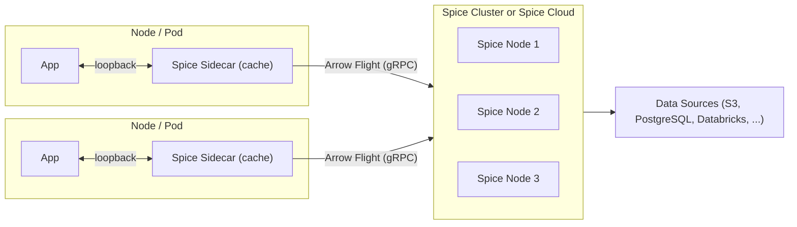

Modern applications have two fundamentally different data access patterns, and no single deployment model serves both well. Large analytical queries — scanning terabytes of Iceberg data, joining Delta Lake tables, running cross-dataset aggregations — need distributed execution across many nodes. Hot operational queries — serving the working set a microservice actually uses, answering user-facing requests in under 5 milliseconds, feeding fresh context to an AI agent — need data materialized right next to the application, with no network hop.

The [cluster-sidecar architecture](https://spice.ai/blog/cluster-sidecar-architecture) addresses both patterns in a single platform. Application sidecars handle the hot path with locally accelerated data, while a centralized Spice [cluster](./cluster) (or the [Spice Cloud Platform](./hosted)) provides distributed compute for heavy queries, data ingestion, acceleration, and refresh. When a sidecar needs to reach beyond its materialized working set — a historical query, a cross-dataset join, a broad search — it transparently delegates to the cluster, which executes the query and returns results. The sidecar can then cache those results for future use.

From the application's perspective, everything is localhost. From an infrastructure perspective, the system delivers the throughput of a distributed query engine and the latency of an embedded database — without ETL between them, sync jobs, or consistency gaps.

Think of it as a CDN for your data: the cluster is the origin server, the sidecars are the edge nodes, and Spice handles the caching, invalidation, and routing.

Each sidecar is configured declaratively via a `spicepod.yaml` — the datasets, views, acceleration engines, search indices, and AI models it manages. Sidecars start in seconds, consume minimal resources, and scale horizontally with application pods: scale a deployment from 5 to 50 replicas and 50 sidecars come up automatically, each caching and materializing the right data.

**Benefits**

- **Kubernetes-native** — designed to run on Kubernetes, leveraging pod-level sidecars with cluster-level orchestration.
- Sub-millisecond reads via sidecar caching on loopback, with centralized data management in the cluster.
- Transparent query delegation — sidecars automatically route queries beyond their cached working set to the cluster.
- Sidecars remain lightweight — only caching, no ingestion or acceleration overhead.
- Cluster (or Spice Cloud) handles complex operations: data ingestion, [Spice Cayenne](../../components/data-accelerators/cayenne) acceleration, distributed query, hybrid search, and refresh from sources.
- Works with both self-managed Spice clusters and the managed [Spice Cloud Platform](./hosted) as the centralized backend. The Spice Cloud cluster-sidecar model is the most common production topology.
- Sidecars can run anywhere — in your VPC, on-premises, at the edge, or in any Kubernetes cluster — while connecting securely to the managed cluster.
- Horizontal scalability — add sidecars without increasing load on data sources.
- Resilience — sidecars serve cached data even if the cluster is temporarily unavailable.
- Secure by default — mTLS encryption across all sidecar-to-cluster communication, with data encrypted at rest and in transit.

**Considerations**

- More complex deployment structure requiring both sidecar and cluster infrastructure. [Spice Cloud](./hosted) reduces this burden by managing the cluster.
- Cache coherency — sidecars must be configured with appropriate refresh intervals or TTLs to balance freshness with performance.
- Requires a Spice cluster deployment or [Spice Cloud Platform](./hosted) subscription ([Spice.ai Enterprise](https://spice.ai/enterprise) for self-managed clustering with SSO, RBAC, and audit logs).
- Network connectivity between sidecars and the cluster must be reliable for cache refreshes and query delegation.

**Use This Approach When**

- Applications require sub-millisecond reads but data ingestion and acceleration should be centralized.
- Multiple application instances need fast access to the same datasets without each independently querying data sources.
- Reducing load on upstream data sources is a priority — the cluster ingests once, sidecars cache locally.
- The system benefits from separating the caching tier (sidecars) from the data processing tier (cluster).
- Workloads span both real-time operational queries and large-scale analytical queries on the same data (e.g., an operational data lakehouse on S3/Iceberg).

**Not Ideal When**

- The application is simple with a single instance — the overhead of both sidecar and cluster infrastructure isn't justified. Consider [Sidecar](./sidecar) or [Microservice](./microservice).
- All queries are batch or analytical with relaxed latency requirements — a [Microservice](./microservice) deployment is simpler and sufficient.
- Network connectivity between sidecars and the cluster is unreliable — query delegation and cache refreshes will fail, leading to stale data. Consider standalone [Sidecar](./sidecar) deployments with direct source access.

**Example Use Case**

A multi-tenant SaaS platform where each tenant's application pod includes a Spice sidecar caching frequently queried datasets. The sidecars pull from a shared Spice cluster (or Spice Cloud) that handles ingestion from PostgreSQL, S3, and Databricks, runs Cayenne acceleration and refresh schedules, and serves distributed queries. Tenants get sub-millisecond reads from their local sidecar while the cluster manages data freshness and heavy query workloads centrally. When a tenant's application issues a query that spans beyond the sidecar's cached working set — such as a historical analysis or cross-dataset join — the sidecar transparently delegates to the cluster and caches the results.

**See also**

- [Read/Write Separation](https://spiceai.org/docs/deployment/read-write-separation) — production guide for splitting ingest from reads using shared acceleration snapshots, including Spicepod and Helm reference configurations.
