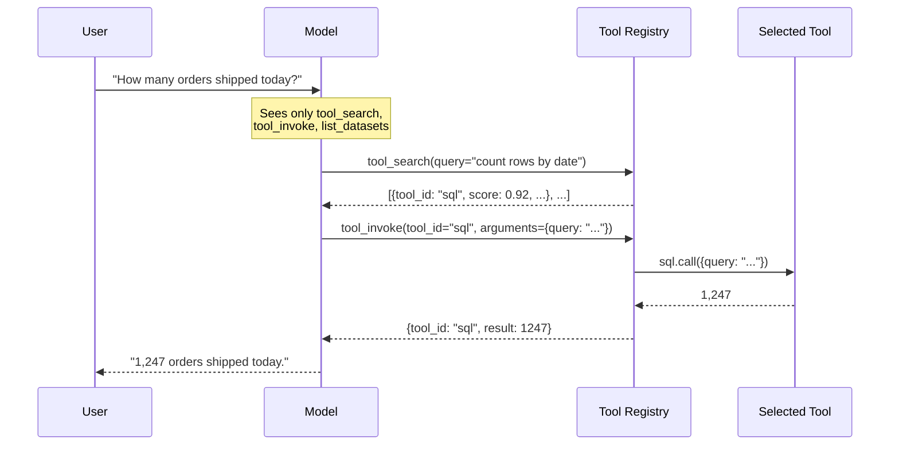

The Tool Registry is a runtime-level capability that replaces large lists of individual tool definitions with two **meta-tools** — `tool_search` and `tool_invoke` — backed by a hybrid search index over the runtime's tool catalog. It's used to keep per-turn token cost bounded as the catalog grows, while preserving the model's ability to discover and call any tool on demand.

The registry indexes every tool that's callable from an LLM, regardless of where it came from:

- Built-in Spice runtime tools (`sql`, `list_datasets`, `table_schema`, `search`, `random_sample`, …)
- [MCP tools](../large-language-models/mcp.md) (servers connected over `sse` or `stdio`)
- [Functions](../functions/index.md) declared in the Spicepod with `as_tool: true` (the default)
- [`tools:`](../reference/spicepod/tools) entries with `as_sql: true` (callable from both SQL and the LLM)

If it can be called from a chat completion, it goes through the registry.

## Why the Tool Registry?

Each tool exposed to a model carries a name, a description, and a JSON Schema for its parameters. A typical tool is **200–500 tokens** of schema; a Spicepod with rich [MCP integrations](../large-language-models/mcp.md), several datasets exposed via `sql` / `table_schema` / `search`, and custom [user-defined functions](../functions/index.md) can quickly cross **50 tools** and **10,000+ tokens** of tool definitions injected into every chat turn.

That cost is paid on every request:

- **Tokens**: tool definitions are part of the system context, billed on every prompt.
- **Latency**: more input tokens means slower first-token times.
- **Accuracy**: research and practice both show LLM tool-selection accuracy degrades when the model is faced with dozens of similarly-named tools.
- **Context window**: tool definitions compete with conversation history, retrieved documents, and reasoning scratch space.

The Tool Registry replaces every individual tool definition with just two meta-tools:

- **`tool_search(query, ...)`** — Searches the registry for tools relevant to a natural-language query. Returns the top N tools with their full schemas.
- **`tool_invoke(tool_id, arguments)`** — Invokes a tool returned by `tool_search`.

For a workload with 50 tools, this is roughly a **10× reduction** in tool-definition tokens injected per turn — the model now only sees the schemas of the tools it actively asks for.



`list_datasets` is always exposed directly alongside the meta-tools so the model can orient itself ("what tables exist?") in a single call without first asking the registry.

## When to Use the Registry

The registry is the right default for any model that has access to **a substantial number of tools** — particularly when those tools include:

- Multiple [MCP servers](../large-language-models/mcp.md) each contributing several tools.
- A Spicepod with many [Functions](../functions/index.md) declared as tools.
- Multiple datasets, each contributing dataset-specific tools (e.g. via the [`tools:`](../reference/spicepod/tools) section).

It's **less useful** when:

- The Spicepod has a small, focused tool set (under ~20 tools).
- The model needs to chain tools without round-tripping through `tool_search` (saves one tool call per turn).
- Deterministic tool exposure is required for evaluation or compliance reasons.

For everything else — especially Spicepods that compose multiple tool sources — `tools: auto` is the recommended default.

## Enabling the Registry

The registry is controlled via the `tools` parameter on a model. Set it to `search_registry` to require registry-based discovery, or `auto` to let Spice decide:

```yaml
embeddings:
  - name: tool_embeddings
    from: openai:text-embedding-3-small

models:
  - name: my-model
    from: openai:gpt-4o
    params:
      tools: search_registry
      tool_embedding_model: tool_embeddings
```

`tools: auto` switches to the registry **only when both** of these are true:

- The number of available tools exceeds **20** (`AUTO_SEARCH_TOOL_THRESHOLD`).
- An embedding model is available.

Otherwise `auto` falls back to providing tools directly — keeping small Spicepods ergonomic while large ones automatically benefit. See the [Tool Modes table](../large-language-models/tools.md#tool-modes) for the full set of values.

### Configuring `tool_embedding_model`

The registry's vector channel uses a configured embedding model:

- **One embedding configured** → used automatically.
- **Multiple embeddings configured** → `tool_embedding_model` is required and must name one of them.
- **No embedding configured** → `tools: search_registry` is rejected; `tools: auto` falls back to direct tools with a warning log.

```yaml
embeddings:
  - name: openai_embed
    from: openai:text-embedding-3-small
  - name: local_embed
    from: huggingface:huggingface.co/sentence-transformers/all-MiniLM-L6-v2

models:
  - name: my-model
    from: openai:gpt-4o
    params:
      tools: search_registry
      tool_embedding_model: openai_embed # disambiguate
```

## How `tool_search` Ranks Results

`tool_search` runs a **hybrid search** over four channels and fuses the results with [Reciprocal Rank Fusion (RRF)](../reference/sql/search#reciprocal-rank-fusion-rrf):

| Channel     | Signal                                                                                                                |
| ----------- | --------------------------------------------------------------------------------------------------------------------- |
| `full_text` | TF-IDF over tokenized tool name (×3 weight), description (×2), and parameters (×1).                                   |
| `keyword`   | Exact-phrase and token matches against name / description / parameter text. Weighted by where the match lands.         |
| `schema`    | Matches against the **parameter keys** in the tool's JSON Schema (e.g. `dataset`, `query`).                            |
| `vector`    | Cosine similarity between the query embedding and per-tool document embeddings.                                       |

Each channel produces a ranked list; RRF combines the ranks (not the scores) so a tool that places top-3 in two channels usually outranks one that places top-1 in a single channel. The final `score` is normalized to `0.0–1.0` against the highest-scoring tool in the result set.

Per-tool embeddings are computed lazily on first search and cached for the lifetime of the registry instance. The runtime keeps an LRU cache (up to 64 entries) of search-tool instances keyed on `(runtime, embedding model, tools hash)` so a Spicepod that hot-reloads tools without restarting the runtime doesn't pay the embedding cost repeatedly.

## `tool_search` Reference

The model calls `tool_search` with a JSON object:

| Parameter   | Type            | Description                                                                                                        |
| ----------- | --------------- | ------------------------------------------------------------------------------------------------------------------ |
| `query`     | `string` (required) | Natural-language description of the capability the model needs.                                                   |
| `keywords`  | `string[]`      | Optional exact-match phrases that boost the keyword channel — useful for column or table names.                    |
| `limit`     | `integer`       | Maximum results to return. Defaults to **5**, capped at **20**.                                                    |
| `min_score` | `number`        | Optional minimum score (0.0–1.0). When the cutoff filters out everything, the registry still returns the unfiltered top match as a fallback so the model isn't left empty-handed. |

Example call (issued by the model):

```json
{
  "query": "count distinct values in a column",
  "keywords": ["distinct", "count"],
  "limit": 3
}
```

### `tool_search` Response

```json
{
  "query": "count distinct values in a column",
  "keywords": ["distinct", "count"],
  "search_mode": "hybrid_rrf",
  "tools": [
    {
      "tool_id": "sql",
      "description": "Execute SQL queries on the runtime.",
      "parameters": { "type": "object", "properties": { "query": { "type": "string" } } },
      "score": 1.0,
      "matched_terms": ["count", "distinct", "sql"],
      "match_sources": [
        { "source": "full_text", "rank": 1, "score": 4.231 },
        { "source": "keyword", "rank": 1, "score": 9.0 },
        { "source": "vector", "rank": 1, "score": 0.812 }
      ]
    }
  ]
}
```

`match_sources` is intentionally surfaced — it lets the model (or a debugger) reason about *why* a tool was returned. A tool that only matched on `vector` but not `full_text` may be a semantic match for an unfamiliar phrasing; one that matched all four is a high-confidence hit.

## `tool_invoke` Reference

| Parameter   | Type     | Description                                                                                |
| ----------- | -------- | ------------------------------------------------------------------------------------------ |
| `tool_id`   | `string` | Tool name returned by `tool_search`.                                                       |
| `arguments` | `object` | JSON object matching the selected tool's parameter schema. Defaults to `{}`.               |

Example:

```json
{
  "tool_id": "sql",
  "arguments": { "query": "SELECT COUNT(DISTINCT customer_id) FROM orders" }
}
```

### `tool_invoke` Response

```json
{
  "tool_id": "sql",
  "result": [{ "count": 1247 }]
}
```

Errors propagate the underlying tool's error message, prefixed with the `tool_id` so the model can decide whether to retry, ask for a different tool, or surface the failure to the user.

## Functions in the Registry

Every [function](../functions/index.md) declared with `as_tool: true` (the default) is registered both as a SQL UDF and as a tool, and therefore participates in the registry. This means a Spicepod with many domain-specific UDFs benefits from the registry exactly the same way as one with many MCP tools — the model only sees the function definitions for the few it actually asks about.

```yaml
runtime:
  functions:
    enabled: true

embeddings:
  - name: tool_embeddings
    from: openai:text-embedding-3-small

functions:
  - name: haversine_km
    from: sql
    description: Haversine great-circle distance in kilometres.
    volatility: immutable
    signature:
      args:
        - { name: lat1, type: float64 }
        - { name: lon1, type: float64 }
        - { name: lat2, type: float64 }
        - { name: lon2, type: float64 }
      returns: float64
    body: |
      6371 * acos(
        cos(radians(lat1)) * cos(radians(lat2)) *
        cos(radians(lon2) - radians(lon1)) +
        sin(radians(lat1)) * sin(radians(lat2))
      )
  # ...many more

models:
  - name: my-model
    from: openai:gpt-4o
    params:
      tools: auto # registry kicks in automatically once the function count crosses the threshold
      tool_embedding_model: tool_embeddings
```

To keep a function out of the registry (and out of the LLM tool surface entirely) while still callable from SQL, set `as_tool: false`:

```yaml
functions:
  - name: internal_hash
    from: sql
    as_tool: false
    signature:
      args: [{ name: x, type: int64 }]
      returns: int64
    body: 'x * 2654435761'
```

User-defined table functions (UDTFs) are SQL-only and are not currently registered as LLM tools, so they don't appear in the registry.

## Reserved Tool Names and Conflicts

`tool_search` and `tool_invoke` are reserved names. If a user-defined tool, function, or MCP tool registers under either name:

- **`tools: search_registry`** → fails at startup with a clear error.
- **`tools: auto`** → logs a warning and falls back to direct tools.

Rename the offending tool, or set `as_tool: false` to keep it SQL-only.

## Discovering What's in the Registry

Two ways to inspect the catalog from outside the model:

- **From SQL** — `SELECT * FROM list_udfs() WHERE source = 'user';` lists every user-declared function, regardless of whether it's currently in the registry.
- **From the HTTP API** — `GET /v1/functions` returns the functions registered as both SQL and tool entries.

For tools (built-in plus MCP plus function-derived), the model can call `tool_search` with an open-ended query (e.g. `query: "*"`) — though in practice, asking for the tools relevant to the current step is what the model actually wants.
